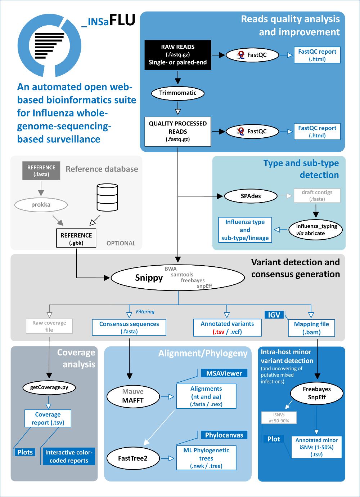

Data analysis
=============

INSaFLU relies on a multi-software bioinformatics pipeline that will be under continuous development and improvement not only to enrich 
it with new features, but also to continuously shape the protocol to the best methodological advances in the field. The current software 
settings were chosen upon intensive testing are detailed as follows (more details for each software can be found in the official repositories; 
links are also provided below). The bioinformatics pipeline developed and implemented in the INSaFLU web platform currently consists of 6 core
steps (see WorkFlow) yielding multiple graphical, and sequence outputs (see *Output visualization and download* menu for details)

INSaFLU bioinformatics pipeline workflow

Bioinformatics pipeline
+++++++++++++++++++++++

*Modules (Description, Current software versions and settings)*

Read quality analysis and improvement.
--------------------------------------

*Description*

This step takes the input single- or paired-end reads (fastq.gz format) and produces Trimmomatic-derived quality processed reads,
as well as FastQC quality control reports for each file, before and after quality improvement. This module is automatically run upon 
reads upload (i.e., no user intervention is needed). 

.. tip::
    FastQC (https://www.bioinformatics.babraham.ac.uk/projects/fastqc/) (version 0.11.5; date 15.01.2018)

		input: paired-end reads (fastq or fastq.gz format) (e.g., sample_L001_R1_001.fastq.gz and sample_L001_R2_001.fastq.gz for Illumina technology reads)
		
		--nogroup option: all reports will show data for every base in the read. 
		
	Trimmomatic (http://www.usadellab.org/cms/index.php?page=trimmomatic) (version 0.27; date 15.01.2018)
	
		input: Illumina or IonTorrent paired-end reads (fastq or fastq.gz format) (e.g., sample_L001_R1_001.fastq.gz and sample_L001_R2_001.fastq.gz for Illumina paired-end reads)
	
		SLIDINGWINDOW: perform a sliding window trimming, cutting once the average quality within the window falls below a threshold (SLIDINGWINDOW:5:20, where 5 refers to window and 20 to the minimum average quality)
	
		LEADING: cut bases off the start of a read, if below a threshold quality (LEADING:3). This will allow discarding bases with very quality or N bases (quality score of 2 or less).
	
		TRAILING: cut bases off the end of a read, if below a threshold quality (TRAILING:3). This will allow discarding bases with very quality or N bases (quality score of 2 or less).
	
		MINLEN: drop the read if it is below a specified length (MINLEN:35)
	
		TOPHRED33:  Convert quality scores to Phred-33

Type and sub-type detection.
----------------------------

*Description*
 
This module uses quality processed reads obtained through Trimmomatic analysis and performs a draft de novo assembly using metaSPAdes. 
The assemblies are subsequently screened (using abricate) against a gene sequence database that allows the discrimination of the 
influenza types A and B, all currently defined influenza A subtypes (18 hemagglutinin subtypes and 11 neuraminidase sub-types) and 
the two influenza B lineages (Yamagata and Victoria). The detection of type and subtype/lineage is automatically provided upon reads 
upload (i.e., no user intervention is needed).

Variant detection and consensus generation
------------------------------------------

*Description*

This key module takes advantage of the multisoftware tool Snippy (please visit the official repository to get details about each component;
https://github.com/tseemann/snippy) to perform reference-based mapping, followed by SNP/indel calling and annotation and generation of 
consensus sequences (quality processed reads obtained through Trimmomatic analysis are used as input).  A reference sequence is selected
for each project after uploading it or from the INSaFLU default reference database (link). Uploaded “.fasta” files are annotated using 
Prokka upon submission and automatically become available at the user-restricted reference database. Each project should ideally 
include viruses from the same type and sub-type/lineage (this typing data is automatically determined upon reads submission to INSaFLU).

Coverage analysis
-----------------

*Description*

This module yields a deep analysis of the coverage for each per sample by providing the following data: mean depth of coverage per amplicon,
% of amplicon size covered by at least 1-fold and % of amplicon size covered by at least 10-fold. The latter fits the minimum depth of
coverage for variant calling applied by INSaFLU pipeline and constitutes the guide for consensus generation, i.e., consensus sequences
(see Module “Variant detection and consensus generation”) are exclusively provided for amplicons fulfilling the criteria of having 100% of
their size covered by at least 10-fold. Depth of coverage plots are additionally generated and can be interactively viewed at INSaFLU.

Alignment/Phylogeny
-------------------

*Description*
 
This module uses filtered nucleotide consensus sequences and performs refined nucleotide/protein sequence alignments and phylogenetic inferences.
These outputs are automatically re-build and updated as more samples are added to user-restricted INSaFLU projects, making continuous data integration
completely flexible and scalable. This module can also be run independently over a set of user-selected sequences (e.g., circulating virus plus
sequences of representative virus of specific genetic groups/clades/lineages), so that phylogenetic diversity of circulating viruses can be better
evaluated and integrated in the frame of guidelines defined by supranational health authorities.

Intra-host minor variant detection (and uncovering of putative mixed infections)
--------------------------------------------------------------------------------

*Description*

This module uses mapping data for the set of samples from each user-restricted INSaFLU project and provides a list of minor intra-host single 
nucleotide variants (iSNVs), i.e., SNV displaying intra-sample frequency between 1- 50%. This output is automatically re-build and cumulatively 
updated as more samples are added to each INSaFLU project, making continuous data integration completely flexible and scalable. Plots of the 
proportion of iSNV at frequency at 1-50%  (minor iSNVs) and at frequency 50-90% detected for each sample are also provided as mean to a guide 
the uncovering of putative mixed infections (exemplified in the Figure). INSaFLU flags samples as “putative mixed infections” if they fulfill 
the following cumulative criteria: the ratio of the number of iSNVs at frequency 50-90% and <50% falls within the range 0,5-1,5 and the sum of 
the number of these two categories of iSNVs exceeds 20.

