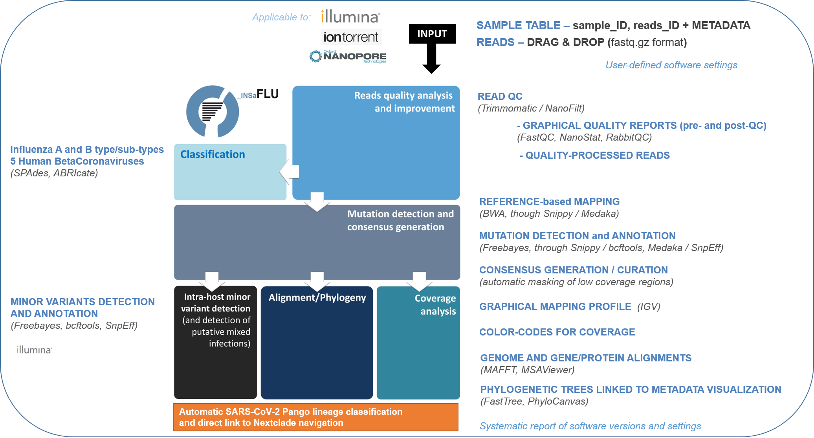

Data analysis
=============

INSaFLU relies on a multi-software bioinformatics pipeline that will be under continuous development and improvement not only to enrich it with new features, but also to continuously shape the protocol to the best methodological advances in the field. 

The current software settings, which were chosen upon intensive testing, are described below. For additional details about the bioinformatics pipeline, please visit the INSaFLU github account: https://github.com/INSaFLU/INSaFLU (more information for each software can also be found in the official repositories; links are also provided below). 

The bioinformatics pipeline developed and implemented in the INSaFLU web platform currently consists of 6 core steps (see WorkFlow) yielding multiple graphical, and sequence outputs (see *Output visualization and download* menu for details)

INSaFLU bioinformatics pipeline workflow

Bioinformatics pipeline
+++++++++++++++++++++++

*Modules (Description, Current software versions and settings)*

Read quality analysis and improvement
--------------------------------------

*Description*

This step takes the input single- or paired-end reads (fastq.gz format) and produces quality processed reads, as well as quality control reports for each file, before and after quality improvement. This module is automatically run upon reads upload (i.e., no user intervention is needed). 

*Software version/settings*

.. note::

	**## ILLUMINA / Ion Torrent data ##**
	
   	**FastQC** (https://www.bioinformatics.babraham.ac.uk/projects/fastqc/) (version 0.11.5; date 15.01.2018)

		input: single- or paired-end reads (fastq.gz format) (e.g., sample_L001_R1_001.fastq.gz and sample_L001_R2_001.fastq.gz for Illumina technology reads)
		
		--nogroup option: all reports will show data for every base in the read. 
		
	**Trimmomatic** (http://www.usadellab.org/cms/index.php?page=trimmomatic) (version 0.27; date 15.01.2018)
	
		input: single- or paired-end reads (fastq.gz format) (e.g., sample_L001_R1_001.fastq.gz and sample_L001_R2_001.fastq.gz for Illumina paired-end reads)
	
		ILLUMINACLIP: To clip adapters from the input file using user-specified adapter sequences. ILLUMINACLIP:<ADAPTER_FILE>:3:30:10:6:true
		
		HEADCROP: Cut the specified number of bases from the start of the read. Range: [0:100]. If value equal to 0 this parameter is excluded.
		
		CROP: Cut the read to a specified length. Range: [0:400]. If value equal to 0 this parameter is excluded.
	
		SLIDINGWINDOW: perform a sliding window trimming, cutting once the average quality within the window falls below a threshold (default: SLIDINGWINDOW:5:20, where 5 refers to window and 20 to the minimum average quality)
	
		LEADING: cut bases off the start of a read, if below a threshold quality (default: LEADING:3). This will allow discarding bases with very quality or N bases (quality score of 2 or less).
	
		TRAILING: cut bases off the end of a read, if below a threshold quality (default: TRAILING:3). This will allow discarding bases with very quality or N bases (quality score of 2 or less).
	
		MINLEN: drop the read if it is below a specified length (MINLEN:35)
	
		TOPHRED33:  Convert quality scores to Phred-33
		
	**## Oxford Nanopore Technologies (ONT) data ##**
		
	**NanoStat** (https://github.com/wdecoster/nanostat) (version 1.4.0)
		
		input: ONT reads (fastq.gz format) 

	**NanoFilt** (https://github.com/wdecoster/nanofilt) (version 2.6.0)
	

		**-q (QUALITY)**: Filter on a minimum average read quality score. Range: [5:30] (default: 10)
		
		**-l (LENGTH)**: Filter on a minimum read length. Range: [50:1000]. (default: 50)
		
		**--headcrop**: Trim n nucleotides from start of read. Range: [1:1000]. If value equal to 0 this parameter is excluded. (default: 70)
		
		**--tailcrop**: Trim n nucleotides from end of read. Range: [1:1000]. If value equal to 0 this parameter is excluded. (default: 70)
		
		**--maxlength**: Set a maximum read length. Range: [100:50000]. If value equal to 0 this parameter is excluded. (default: 0)
		

	**RabbitQC** (https://github.com/ZekunYin/RabbitQC)  (version 0.0.1)**
		
		input: ONT reads (fastq.gz format) pre- and post- quality improvement with NanoFilt
		
		Files between 50 - 300 MB are downsized to ~50 MB before analysis by randomly sampling reads using fastq-sample from fastq-tools package https://github.com/dcjones/fastq-tools (developed by Daniel C. Jones dcjones@cs.washington.edu)

.. note::

	**## ILLUMINA data only ##**
	
		***As of October 10th, 2022**, users can use trimmomatic to perform trimming of primer sequences of several predefined Primer pool sets:
		
			-- SARS-CoV-2 Primal Scheme V3 (https://github.com/artic-network/artic-ncov2019/blob/master/primer_schemes/nCoV-2019/V3/nCoV-2019.tsv)
			
			-- SARS-CoV-2 Primal Scheme V4.1 (https://github.com/artic-network/artic-ncov2019/tree/master/primer_schemes/nCoV-2019/V4.1)
			
			-- Monkeypox Primal Scheme from Welkers, Jonges and van den Ouden (https://www.protocols.io/view/monkeypox-virus-whole-genome-sequencing-using-comb-n2bvj6155lk5/v1)
			
			-- Monkeypox Primal Scheme from Chen et al. (https://www.protocols.io/view/monkeypox-virus-multiplexed-pcr-amplicon-sequencin-5qpvob1nbl4o/v2)
			
		Please contact us if you want to add new Primer pools to the online tool

.. important::
	INSaFLU allows users to configure key parameters for reads quality analysis in the tab **“Settings”**. 
	
	**Please check your settings before uploading new samples to your account.**
	
	See details in https://insaflu.readthedocs.io/en/latest/data_analysis.html#user-defined-parameters

Influenza type and sub-type identification (and Human Betacoronavirus classification, as of March 2020)
-------------------------------------------------------------------------------------------------------

*Description*
 
In this module, post-QC reads (ONT data) or draft assemblies derived from post-QC reads (Illumina / Ion Torrent data) are screened (using ABRIcate) against two INSaFLU in house sequence markers databases: 

i) "influenza_typing", which drives the discrimination of the influenza types A and B, all currently defined influenza A subtypes (18 hemagglutinin subtypes and 11 neuraminidase sub-types) and the two influenza B lineages (Yamagata and Victoria).

ii) "influenza_assign_segments2contigs", which allows the automatic assignment of the assembled contigs to both the corresponding viral segments and to a related reference influenza virus. 

The generated outputs (i.e., draft assemblies, the identified type and subtype/lineage and a table linking contigs to segments/references) are automatically provided upon reads upload (i.e., no user intervention is needed). INSaFLU flags samples as "putative mixed infections" if more than one type, HA or NA subtype or lineage is detected. In addition, specific alerts are generated if an incomplete type/subtype is assigned. 

**As of March 10, 2020, these two databases were upgraded for rapid classification and/or contigs assignment of Human Betacoronavirus (BetaCoV).** Details about the rationale behind this classification and outputs can be found here: :download:`INSaFLU_current_genetic_markers_v8_after_11_12_2021.xlsx <_static/INSaFLU_current_genetic_markers_v8_after_11_12_2021.xlsx>`

Similarly to influenza classification, alerts are generated if, for instance, no BetaCoV virus is assigned or an incomplete human BetaCoV classification is obtained (for instance, due to the presence of a low number of human BetaCoV reads, etc)

*Software version/settings*

.. note::

	**## ILLUMINA data only ##** (under development for ONT data)
	
	**SPAdes** (http://cab.spbu.ru/software/spades/) (version 3.11.1; date 15.01.2018)
   
   		--pe1-1 and --pe1.2 (for paired-end) or -s (for single-end data): define the input files, i.e, quality processed reads (e.g., sample_1P.fastq.gz and sample_2P.fastq.gz)
				
		--only-assembler: runs assembly module only and does not perform reads correction
		
				(contigs with k-mer coverage below '3' are discarded for subsequent ABRIcate analyses to avoid the classification of vestigial sequencer-derived contaminating sequences)
	
	**ABRIcate** (https://github.com/tseemann/abricate) (version 0.8-dev; date 15.01.2018)
	
		# For type and subtype/lineage identification (and Human BetaCoV classification*):
	
		--db influeza_typing: the INSaFLU "influenza_tying" database includes a set of type- and sub-type/lineage-specific gene markers that ensure the discrimination of the influenza types A and B, all currently defined influenza A subtypes (18 hemagglutinin subtypes and 11 neuraminidase sub-types) and the two influenza B lineages (Yamagata and Victoria).
	
		--minid: minimum DNA %identity (--minid 70)
		
		--mincov: minimum DNA % coverage (--mincov 60)
		

		***As of March 10th, 2020**, samples can be classified as: 

		- "BetaCoV” if the draft assemblies (Illumina/Ion Torrent data) or post-QC reads (ONT data) contain an “M gene” with ≥70% identity and ≥60% coverage to one of the M (partial) gene marker sequences of the five representative Human BetaCoronavirus genomes in the database)
		
		- “SARS_CoV_2”, "SCoV2_potential_Omicron", “MERS_CoV”, “SARS_CoV”, “HCoV_HKU1” or “HCoV_OC43” if the draft assemblies (Illumina/Ion Torrent data) or post-QC reads (ONT data) contain a “S gene” with ≥70% Identity and ≥60% coverage to one of the S (partial) gene marker sequences of the five representative Human BetaCoronavirus (the classification reflects the closest match among the five human BetaCoV listed above).

				
		# For segments/references assignment: 
		
		--db influeza_assign_segments2contigs: this database includes segment sequence markers of several seasonal human influenza [including: i) post-pandemic (2009) vaccine/reference influenza A(H1N1)pdm2009, A(H3N2) and B viruses; ii) representative viruses of specific genetic groups/lineages/clades, as defined by International Health Authorities for each season)], as well as of avian influenza from several HA/NA subtypes (i.e., H1N1, H2N2, H5N1, H7N9, etc)
	
		--minid: minimum DNA %identity (--minid 70)
		
		--mincov: minimum DNA % coverage (--mincov 30)
		
		**As of March 10th, 2020,** draft assemblies (Illumina/Ion Torrent data) or post-QC reads (ONT data) are labeled with the closest match among the five human BetaCoV (see above) if they have ≥70% Identity and ≥30% coverage to one of the five BetaCoV full-genome sequences (for assemblies) or partial S/M genes (for ONT reads) in the database.
		
		Important note: Since the "influeza_assign_segments2contigs" database is naturally not as exhaustive as other databases (such as, NCBI, Fludb or EpiFLU/GISAID), users may need to run the draft assemblies in these databases (or associated tools, such as BLAST) for some purposes (e.g., to detect/confirm reassortments or to infer the closest reference sequence of each segment / genome).
		

Latest list of genetic markers (version 8; 11.12.2021) can be downloaded here: 

:download:`INSaFLU_current_genetic_markers_v8_after_11_12_2021.xlsx <_static/INSaFLU_current_genetic_markers_v8_after_11_12_2021.xlsx>`
				
Previous database versions can be downloaded here:

version 7 (until 11.12.2021) :download:`INSaFLU_genetic_markers_v7_before_11_12_2021.xlsx <_static/INSaFLU_genetic_markers_v7_before_11_12_2021.xlsx>`

version 6 (until 27.07.2021) :download:`INSaFLU_genetic_markers_v6_before_27_07_2021.xlsx <_static/INSaFLU_genetic_markers_v6_before_27_07_2021.xlsx>`

version 5 (until 10.03.2020) :download:`INSaFLU_genetic_markers_v5_before_10_03_2020.xlsx <_static/INSaFLU_genetic_markers_v5_before_10_03_2020.xlsx>`

version 4 (until 10.01.2020) :download:`INSaFLU_genetic_markers_v4_before_10_01_2020.xlsx <_static/INSaFLU_genetic_markers_v4_before_10_01_2020.xlsx>`

version 3 (until 02.01.2019) :download:`INSaFLU_genetic_markers_v3_before_02_01_2019.xlsx <_static/INSaFLU_genetic_markers_v3_before_02_01_2019.xlsx>`

version 2 (until 05.06.2018) :download:`INSaFLU_genetic_markers_v2_before_05_06_2018.xlsx <_static/INSaFLU_genetic_markers_v2_before_05_06_2018.xlsx>`

version 1 (until 14.05.2018) :download:`INSaFLU_genetic_markers_v1_before_14_05_2018.xlsx <_static/INSaFLU_genetic_markers_v1_before_14_05_2018.xlsx>`		

Variant detection and consensus generation
------------------------------------------

*Description*

This key module takes enables reference-based mapping, followed by SNP/indel calling and annotation and generation of consensus sequences (quality processed reads obtained through Trimmomatic analysis are used as input). Quality processed reads obtained through Trimmomatic (Illumina/IonTorrent data) NanoFilt (ONT data) are used as input. A reference sequence must be selected for each project (select one from INSaFLU default reference database or upload one of your choice).  Uploaded “.fasta” files are annotated upon submission and automatically become available at the user-restricted reference database. For influenza, each project should ideally include viruses from the same type and sub-type/lineage (this typing data is automatically determined upon reads submission to INSaFLU).

*Software version/settings*

.. note::

	**##REFERENCE ANNOTATION##**
	
	**Prokka** (https://github.com/tseemann/prokka) (version 1.12; date 15.01.2018)
   
		--kingdom: defines the Annotation mode (Viruses)
	
	
	**##ILLUMINA / Ion Torrent data##**
	
	**Snippy** (https://github.com/tseemann/snippy) (version 3.2-dev - sligthly modified (details in https://github.com/INSaFLU/INSaFLU); date 15.01.2018)
	
		--R1 (and --R2): define the reads files used as input, i.e, quality processed reads (e.g., sample_1P.fastq.gz and sample_2P.fastq.gz) obtained after Trimmomatic analysis
		
		--ref: define the reference sequence selected by the users (.fasta or gbk format) 
		
		--mapqual: minimum mapping quality to accept in variant calling(default: --mapqual 20) 
		
		--mincov: minimum coverage of variant site (default: --mincov 10)
		
		--minfrac: minimum proportion for variant evidence (default: --minfrac 0.51)
		
		
	**## Oxford Nanopore Technologies (ONT) data ##**
	
	_Mapping:
	
	**Medaka** (https://nanoporetech.github.io/medaka/ (version 1.2.1)
		
		input: ONT quality processed reads obtained after NanoFilt analysis.
		
		medaka consensus -m model (default: r941_min_high_g360)
		
		medaka variant
		
	_VCF filtering:
	
		Mutations are filtered out based on the following user-defined criteria:
		
			**Minimum depth of coverage  per site** (equivalent to --mincov in Illumina pipeline) (default: 30)
			
			**Minimum proportion  for variant evidence** (equivalent to --minfrac in Illumina pipeline) (default: 0.8)
			
			
	For each mutation, two COVERAGE values are provided in final table output: the depth of unambiguous reads spanning pos +-25 (as provided by medaka variant module) and depth per site as provided by samtools (depth -aa). Values are separated by “/”. 
	
	_Consensus generation and mutation annotation (i.e., impact at protein level):
	
	Consensus sequences are generated using bcftools (consensus -s sample.filtered.vcf.gz -f reference.fasta > sample.consensus.fasta) based on the vcf file containing the validated mutations. As for the Illumina pipeline, variant annotation is performed using snpEff 4.1l available with Snippy (see above).

	
		
	**Masking low coverage regions:**

	**msa_masker.py** (https://github.com/rfm-targa/BioinfUtils/blob/master/msa_masker.py; kind contribution of Rafael Mamede).
	
	This script substitutes positions with a low depth of coverage in a Multiple Sequence Alignment (MSA) with 'N'. The depth of coverage value below which the process masks positions is user-selected (see  “User-defined parameters”). It will not mask gaps/indels contained in the aligned sequences.
	
	-i: input FASTA file that contains a MAFFT nucleotide alignment enrolling the reference sequence (first sequence of the alignment) and consensus sequence(s) to be masked.
	
	-df: the coverage files (.depth)
	
	-r: define the reference sequence selected by the users (.fasta format) 
	
	-c: Positions with a depth value equal or below the value of this argument will be substituted by N (default= “mincov” - 1).
	
	
	**MAPPING VISUALIZATION**
					
	**Integrative Genomics Viewer** (http://software.broadinstitute.org/software/igv/)
	
		inputs: reference file (.fasta); mapping file (.bam; .bai)
		

.. important::
	INSaFLU allows users to configure key parameters for variant detection and consensus generation. **Settings** can be user-defined for the whole user account (tab “Settings”), for each project (after project creation) or for individuals samples within a project. 
	When parameters are changed for a given sample within a Project, the sample is automatically re-analysed using the novel parameters and re-inserted in the Project.
	See details in https://insaflu.readthedocs.io/en/latest/data_analysis.html#user-defined-parameters

Coverage analysis
-----------------

*Description*

This module yields a deep analysis of the coverage for each per sample by providing the following data: depth of coverage per nucleotide site, mean depth of coverage per locus, % of locus size covered by at least 1-fold and % of locus size covered by at least a user-defined "mincov" threshold (this parameter is user-selected for a Project or for a given sample within a Project). The latter constitutes the guide for consensus generation, i.e., consensus sequences are exclusively provided for locus fulfilling the criteria of having Y% of their size covered by at least X-fold (X = mincov; Y = minimum horizontal coverage) (see sections “Variant detection and consensus generation” and “User-defined parameters”). Coverage data is provided both in tabular format and interactive plots.

*Software version/settings*

.. note::
   	
	**Script used to generate Coverage statistics:**
	
	**getCoverage.py** (https://github.com/monsanto-pinheiro/getCoverage, by Miguel Pinheiro) (version v1.1; date 15.01.2018)
   
  	 	-i: define the input files, i.e, the coverage files (.depth.gz)
   
  		-r: define the reference sequence selected by the users (.fasta format) 
   
  		-o: defines the output file name (tab-separated value)
		
		
	**Script used to mask low coverage regions**

	**msa_masker.py** (https://github.com/rfm-targa/BioinfUtils/blob/master/msa_masker.py; kind contribution of Rafael Mamede)
	
	This script substitutes positions with a low depth of coverage in a Multiple Sequence Alignment (MSA) with 'N'. The depth of coverage value below which the process masks positions is user-selected (see  “User-defined parameters”). It will not mask gaps/indels contained in the aligned sequences.
	
	-i: input FASTA file that contains a MAFFT nucleotide alignment enrolling the reference sequence (first sequence of the alignment) and consensus sequence(s) to be masked.
	
	-df: the coverage files (.depth) 
	
	-r: define the reference sequence selected by the users (.fasta format) 
	
	-c: Positions with a depth value equal or below the value of this argument will be substituted by N (default= “mincov” - 1).

		

Alignment/Phylogeny
-------------------

*Description*
 
This module uses filtered nucleotide consensus sequences and performs refined nucleotide/protein sequence alignments and phylogenetic inferences. These outputs are automatically re-build and updated as more samples are added to user-restricted INSaFLU projects, making continuous data integration completely flexible and scalable. 

Users can also easily color the phylogenetic tree nodes and/or display colored metadata blocks next to the tree according to any combination of metadata variables, which facilitates the integration of relevant epidemiological and/or clinical data towards an enhanced genome-based pathogen surveillance. 

*Software version/settings*

.. note::
  	**MAUVE** (http://darlinglab.org/mauve/mauve.html) (version 2.4.0; date 15.01.2018)
   
   		progressiveMAUVE module (default settings): this algorithm is applied to perform primary draft alignments, and has the particular advantage of automatically concatenating multi-fasta input sequences during whole-genome alignments construction.
		
		input file: filtered nucleotide consensus sequences for each sample, one per each amplicon target (which are , in general, influenza CDSs) and another for the whole-genome sequence (i.e., the set of sequence targeted by the amplicon-based NGS shema, which, in general, is the pool of main 8 influenza CDSs). xmfa to fasta conversion is carried out using "convertAlignment.pl" (https://github.com/lskatz/lyve-SET/blob/master/scripts/convertAlignment.pl
		
		(default settings)
		
	**MAFFT**  (https://mafft.cbrc.jp/alignment/software/) (version 7.313; date 15.01.2018)

		For nucleotide alignments:
		
			input file: progressiveMAUVE-derived draft alignments (multifasta format), one per each locus and another for the whole-genome sequence 
		
			(default settings)
		
		For amino acid alignments:
		
			--amino: assume the sequences are in amino acid.
		
	**FastTree**  (http://www.microbesonline.org/fasttree/) (version 2.1.10 Double precision; date 15.01.2018)
	
			Double-precision mode: suitable for resolving very-short branch lengths accurately (FastTreeDbl executable)
			
			-nt: defines the input nucleotide alignment, which is a MAFFT-derived refined alignments (multifasta format). Alignments to be run include one per each locus and another for the whole-genome sequence.
			
			--gtr: defines the Generalized time-reversible (GTR) model of nucleotide evolution (CAT approximation with 20 rate categories)
			
			-boot: defines the number resample (-boot 1000)
			
	**Seqret** EMBOSS tool (http://emboss.sourceforge.net/apps/release/6.6/emboss/apps/) (version 6.6.0.0; date 15.01.2018)
	
		input file: nucleotide alignments in FASTA (.fasta) to be converted in NEXUS (.nex) format 
	
	**MSAViewer**  (http://msa.biojs.net/) (latest; date 15.01.2018)
	
		input files: consensus nucleotide alignments for each locus and for the consensus 'whole-genome' sequence (upon concatenation of all individual locus); and amino acid alignments for the encoded proteins
		
	**Phylocanvas** (http://phylocanvas.org/) (version 2.8.1; date 15.01.2018)
	
		input files: phylogenetic tree obtained from each locus-specific nucleotide alignment and from the alignment of the 'whole-genome' sequences (upon concatenation of all individual locus)

		Metadata visualization tools were built with great contribution from Luís Rita: https://github.com/warcraft12321

Intra-host minor variant detection (and uncovering of putative mixed infections)
--------------------------------------------------------------------------------

*Description*

This module uses mapping data for the set of samples from each user-restricted INSaFLU project and provides a list of minor intra-host single nucleotide variants (iSNVs), i.e., SNV displaying intra-sample frequency between 1- 50%. This output is automatically re-build and cumulatively updated as more samples are added to each INSaFLU project, making continuous data integration completely flexible and scalable. Plots of the proportion of iSNV at frequency at 1-50%  (minor iSNVs) and at frequency 50-90% detected for each sample are also provided as mean to a guide the uncovering of putative mixed infections (exemplified in the Figure). INSaFLU flags samples as “putative mixed infections” based on intra-host SNVs if the following cumulative criteria are fulfilled: the ratio of the number of iSNVs at frequency at 1-50%  (minor iSNVs) and 50-90% falls within the range 0,5-2,0 and the sum of the number of these two categories of iSNVs exceeds 20. Alternatively, to account for mixed infections involving extremely different viruses (e.g., A/H3N2 and A/H1N1), the flag is also displayed when the the sum of the two categories of iSNVs exceeds 100, regardless of the first criterion. 

.. image:: _static/graph_mixed.png

*Software version/settings*

.. note::
   **Freebayes** (https://github.com/ekg/freebayes) (version v1.1.0-54-g49413aa; date 15.01.2018)
   
   		--min-mapping-quality: excludes read alignments from analysis if they have a mapping quality less than Q (--min-mapping-quality 20)
   		
   		--min-base-quality: excludes alleles from iSNV analysis if their supporting base quality is less than Q (--min-base-quality 20)
   		
   		--min-coverage: requires at least 100-fold of coverage to process a site (--min-coverage 100)
   		
   		--min-alternate-count: require at least 10 reads supporting an alternate allele within a single individual in order to evaluate the position (--min-alternate-count 10)
   		
   		--min-alternate-fraction: defines the minimum intra-host frequency of the alternate allele to be assumed (--min-alternate-fraction 0.01). This frequency is contingent on the depth of coverage of each processed site since min-alternate-count is set to 10, i.e., the identification of iSNV sites at frequencies of 10%, 2% and 1% is only allowed for sites with depth of coverage of at least 100-fold, 500-fold and 1000-fold, respectively.

Algn2pheno
--------------------------------------------------------------------------------

*Description*

The align2pheno module in INSaFLU performs the screening of genetic features potentially linked to specific phenotypes. Aln2pheno currently screens SARS-CoV-2 Spike amino acid alignments in each SARS-CoV-2 project against two default "genotype-phenotype" databases: the COG-UK Antigenic mutations and the Pokay Database (detailed below). Align2pheno reports the repertoire of mutations of interest per sequence and their potential impact on phenotype.

.. note::
**Algn2pheno** (https://github.com/insapathogenomics/algn2pheno)
   
   INSaFLU only runs the align2pheno module over Spike amino acid sequences with less than 10% of undefined amino acids (i.e., positions below the coverage cut-off; labelled as “X” in the protein alignments/sequences).
   
   Software and databases versions are provided in a log file in each run.

*Databases*

**Pokay Database**

Description: Database of Spike amino acid mutations adapted from the curated database available through the tool Pokay, which includes a comprehensive list of SARS-CoV-2 mutations, and their associated functional impact (e.g., vaccine efficacy, pharmaceutical effectiveness, etc.) collected from literature. Made available by the CSM Center for Health Genomics and Informatics, University of Calgary.

Source: https://github.com/nodrogluap/pokay

**COG-UK Antigenic Mutations Database**

Description: Database of Spike amino acid mutations adapted from the COG-UK Antigenic Mutations Database that includes “Spike amino acid replacements reported to confer antigenic change relevant to antibodies, detected in the UK data. The table lists those mutations in the spike gene identified in the UK dataset that have been associated with weaker neutralisation of the virus by convalescent plasma from people who have been infected with SARS-CoV-2, and/or monoclonal antibodies (mAbs) that recognise the SARS-CoV-2 spike protein.” Made available by the COVID-19 Genomics UK (COG-UK) Consortium through the COG-UK/Mutation Explorer.

Source: https://sars2.cvr.gla.ac.uk/cog-uk/

User-defined parameters
+++++++++++++++++++++++++

INSaFLU allows turning ON/OFF specific modules and user-defined configuration of key parameters for reads quality analysis and mapping. Settings can be user-defined for the whole user account (tab “Settings”), for each project (just after project creation) or for individual samples within a project (click in the "Magic wand" icon).

Read quality analysis and improvement control (QC)
--------------------------------------------------
**Please choose your settings before uploading new samples to your account.**

**##ILLUMINA / Ion Torrent data##**

Users can change the following **Trimmomatic** settings (see http://www.usadellab.org/cms/index.php?page=trimmomatic):

**ILLUMINACLIP**: To clip the Illumina adapters from the input file using the adapter sequences. ILLUMINACLIP:<ADAPTER_FILE>:3:30:10:6:true (default: Not apply)
		
**HEADCROP**: <length> Cut the specified number of bases from the start of the read. Range: [0:100]. If value equal to 0 this parameter is excluded. (default = 0)

**CROP**:<length> Cut the read to a specified length. Range: [0:400]. If value equal to 0 this parameter is excluded. (default = 0)

**SLIDINGWINDOW**:<windowSize> specifies the number of bases to average across Range: [3:50]. (default = 5)

**SLIDINGWINDOW**:<requiredQuality> specifies the average quality required Range: [10:100]. (default = 20)

**LEADING**:<quality> Remove low quality bases from the beginning. Range: [0:100]. If value equal to 0 this parameter is excluded. (default = 3)

**TRAILING**:<quality> Remove low quality bases from the end. Range: [0:100]. If value equal to 0 this parameter is excluded. (default = 3)

**MINLEN**:<length> This module removes reads that fall below the specified minimal length. Range: [5:500]. (default = 35)

NOTE: "Trimming occurs in the order which the parameters are listed"

**## Oxford Nanopore Technologies (ONT) data ##**

Users can change the following **NanoFilt** settings (see: https://github.com/wdecoster/nanofilt)

**QUALITY**: Filter on a minimum average read quality score. Range: [5:30] (default: 10)

**LENGTH**: Filter on a minimum read length. Range: [50:1000]. (default: 50)

**HEADCROP**:  Trim n nucleotides from start of read. Range: [1:1000]. If value equal to 0 this parameter is excluded. (default: 70)

**TAILCROP**: Trim n nucleotides from end of read. Range: [1:1000]. If value equal to 0 this parameter is excluded. (default: 70)

**MAXLENGTH:** Set a maximum read length. Range: [100:50000]. If value equal to 0 this parameter is excluded. (default: 0)

Mapping, Variant Calling
-------------------------

**##ILLUMINA / Ion Torrent data##**

Users can change the following **Snippy** settings (see also https://github.com/tseemann/snippy):

**--mapqual**: minimum mapping quality to accept in variant calling (default = 20)

**--mincov**: minimum number of reads covering a site to be considered (default = 10)

**--minfrac**: minimum proportion of reads which must differ from the reference, so that the variant is assumed in the consensus sequence (default = 0.51)

**## Oxford Nanopore Technologies (ONT) data ##**

Users can change the following settings:

**Medaka model** (default: r941_min_high_g360) (see: https://nanoporetech.github.io/medaka/)

**Minimum depth of coverage per site** (equivalent to --mincov in Illumina pipeline) (default: 30) 

**Minimum proportion for variant evidence** (equivalent to --minfrac in Illumina pipeline) (default: 0.8). Note: medaka-derived mutations with frequencies below the user-defined “minfrac” will be masked with an “N”. 

Consensus generation (horizontal coverage cut-off) and Masking
--------------------------------------------------------------
Users can select the **Minimum percentage of horizontal coverage to generate consensus**. This threshold indicates the **Minimum percentage of locus horizontal coverage** with depth of coverage equal or above –mincov (see Mapping settings) to generate a consensus sequence for a given locus. Range: [50:100] (default = 70)

In Projects setting, users can also **mask (i.e., put Ns) specific regions (or sites)** of the consensus sequences for all (or individual) samples within a given Project. This feature is especially useful for masking the start/end of the sequences or known error-prone nucleotide sites. 

.. image:: _static/masking_consensus_projects.png

**Masking summary:**

Undefined nucleotides (NNN) are automatically placed in: 
i) low coverage regions (i.e., regions with coverage below --mincov); 
ii) regions (or sites) selected to be masked by the user (in Projects settings); 
iii) for ONT data, medaka-derived mutations with frequencies below the user-defined “minfrac” (i.e. Minimum proportion for variant evidence).

