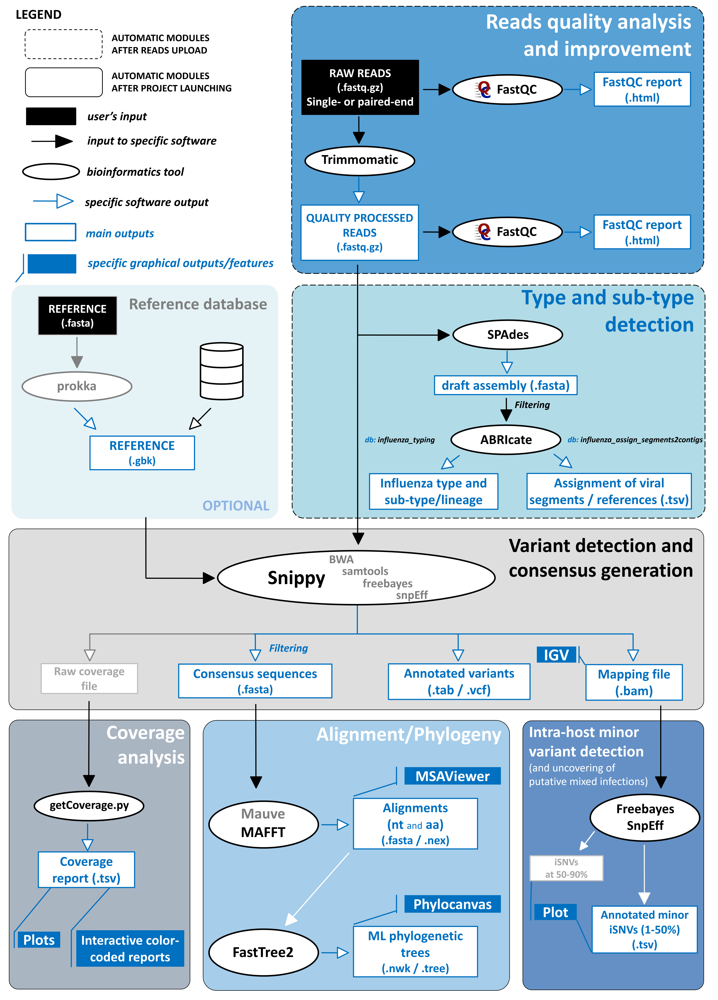
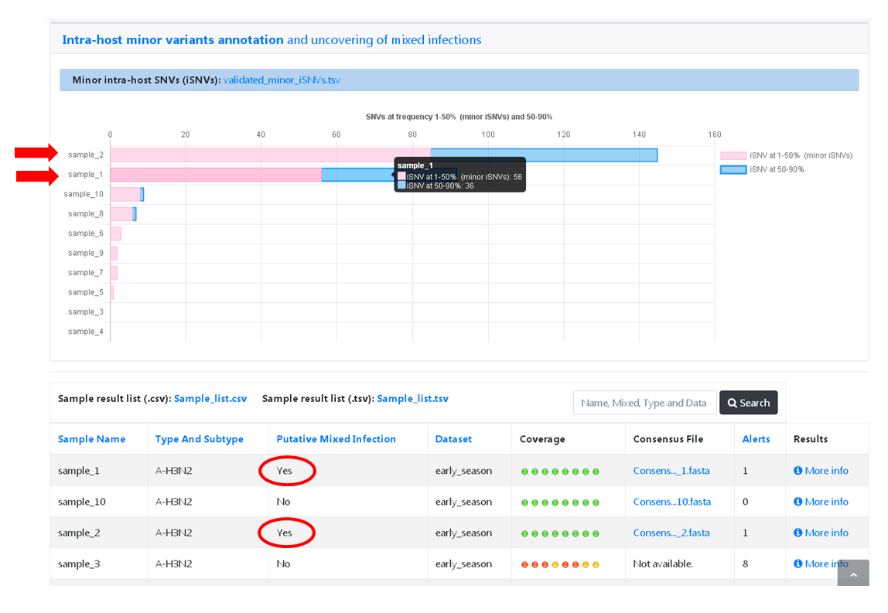

Data analysis
=============

INSaFLU relies on a multi-software bioinformatics pipeline that will be under continuous development and improvement not only to enrich it with new features, but also to continuously shape the protocol to the best methodological advances in the field. The current software settings, which were chosen upon intensive testing, are detailed below (more details for each software can be found in the official repositories; links are also provided below). The bioinformatics pipeline developed and implemented in the INSaFLU web platform currently consists of 6 core steps (see WorkFlow) yielding multiple graphical, and sequence outputs (see *Output visualization and download* menu for details)

INSaFLU bioinformatics pipeline workflow

Bioinformatics pipeline
+++++++++++++++++++++++

*Modules (Description, Current software versions and settings)*

Read quality analysis and improvement
--------------------------------------

*Description*

This step takes the input single- or paired-end reads (fastq.gz format) and produces Trimmomatic-derived quality processed reads, as well as FastQC quality control reports for each file, before and after quality improvement. This module is automatically run upon reads upload (i.e., no user intervention is needed). 

*Software version/settings*

.. note::
   	**FastQC** (https://www.bioinformatics.babraham.ac.uk/projects/fastqc/) (version 0.11.5; date 15.01.2018)

		input: single- or paired-end reads (fastq.gz format) (e.g., sample_L001_R1_001.fastq.gz and sample_L001_R2_001.fastq.gz for Illumina technology reads)
		
		--nogroup option: all reports will show data for every base in the read. 
		
	**Trimmomatic** (http://www.usadellab.org/cms/index.php?page=trimmomatic) (version 0.27; date 15.01.2018)
	
		input: single- or paired-end reads (fastq.gz format) (e.g., sample_L001_R1_001.fastq.gz and sample_L001_R2_001.fastq.gz for Illumina paired-end reads)
	
		SLIDINGWINDOW: perform a sliding window trimming, cutting once the average quality within the window falls below a threshold (SLIDINGWINDOW:5:20, where 5 refers to window and 20 to the minimum average quality)
	
		LEADING: cut bases off the start of a read, if below a threshold quality (LEADING:3). This will allow discarding bases with very quality or N bases (quality score of 2 or less).
	
		TRAILING: cut bases off the end of a read, if below a threshold quality (TRAILING:3). This will allow discarding bases with very quality or N bases (quality score of 2 or less).
	
		MINLEN: drop the read if it is below a specified length (MINLEN:35)
	
		TOPHRED33:  Convert quality scores to Phred-33

Type and sub-type identification
--------------------------------

*Description*
 
This module uses quality processed reads obtained through Trimmomatic analysis and performs a draft de novo assembly using SPAdes. The assemblies are subsequently screened (using ABRIcate) against two INSaFLU in house sequence markers databases: 

i) "influenza_typing", which drives the discrimination of the influenza types A and B, all currently defined influenza A subtypes (18 hemagglutinin subtypes and 11 neuraminidase sub-types) and the two influenza B lineages (Yamagata and Victoria).

ii) "influenza_assign_segments2contigs", which allows the automatic assignment of the assembled contigs to both the corresponding viral segments and to a related reference influenza virus. 

The generated outputs (i.e., draft assemblies, the identified type and subtype/lineage and a table linking contigs to segments/refernces) are automatically provided upon reads upload (i.e., no user intervention is needed). INSaFLU flags samples as "putative mixed infections" if more than one type, HA or NA subtype or lineage is detected. In addition, specific alerts are generated if an incomplete type/subtype is assigned.

*Software version/settings*

.. note::
	**SPAdes** (http://cab.spbu.ru/software/spades/) (version 3.11.1; date 15.01.2018)
   
   		--pe1-1 and --pe1.2 (for paired-end) or -s (for single-end data): define the input files, i.e, quality processed reads (e.g., sample_1P.fastq.gz and sample_2P.fastq.gz)
				
		--only-assembler: runs assembly module only and does not perform reads correction
		
				(contigs with k-mer coverage below '3' are discarded for ABRIcate analysis)
	
	**ABRIcate** (https://github.com/tseemann/abricate) (version 0.8-dev; date 15.01.2018)
	
		# For type and subtype/lineage identification:
	
		--db influeza_typing: the INSaFLU "influenza_tying" database includes a set of type- and sub-type/lineage-specific gene markers that ensure the discrimination of the influenza types A and B, all currently defined influenza A subtypes (18 hemagglutinin subtypes and 11 neuraminidase sub-types) and the two influenza B lineages (Yamagata and Victoria).
	
		--minid: minimum DNA %identity (--minid 70)
		
		--mincov: minimum DNA % coverage (--mincov 60)
		
		
		# For segments/references assignment: 
		
		--db influeza_assign_segments2contigs: this database includes segment sequence markers of several seasonal human influenza virus [including: i) post-pandemic (2009) vaccine/reference influenza A(H1N1)pdm2009, A(H3N2) and B viruses (from both Northern and Southern hemispheres); ii) representative viruses of specific genetic groups/lineages/clades, as defined by International Health authorities for each influenza)], but also from avian influenza from several HA/NA subtypes (i.e., H1N1, H2N2, H5N1, H7N9, etc)
	
		--minid: minimum DNA %identity (--minid 70)
		
		--mincov: minimum DNA % coverage (--mincov 30)

				Important note: Since the "influeza_assign_segments2contigs" database is naturally not as exhaustive as other databases (such as, NCBI, Fludb or EpiFLU/GISAID), users may need to run the draft assmblies in these databases (or associated tools, such as BLAST)for some purposes (e.g., to detect/confirm reassortments or to infer rhe closest reference sequence of each segment.
		
		
Variant detection and consensus generation
------------------------------------------

*Description*

This key module takes advantage of the multisoftware tool Snippy (please visit the official repository to get details about each component; https://github.com/tseemann/snippy) to perform reference-based mapping, followed by SNP/indel calling and annotation and generation of consensus sequences (quality processed reads obtained through Trimmomatic analysis are used as input).  A reference sequence is selected for each project after uploading it or from the INSaFLU default reference database. Uploaded “.fasta” files are annotated using Prokka upon submission and automatically become available at the user-restricted reference database. Each project should ideally include viruses from the same type and sub-type/lineage (this typing data is automatically determined upon reads submission to INSaFLU).

*Software version/settings*

.. note::
	**Prokka** (https://github.com/tseemann/prokka) (version 1.2; date 15.01.2018)
   
		--kingdom: defines the Annotation mode (Viruses)
		
	**Snippy** (https://github.com/tseemann/snippy) (version 3.2-dev; date 15.01.2018)
	
		--R1 (and --R2): define the reads files used as input, i.e, quality processed reads (e.g., sample_1P.fastq.gz and sample_2P.fastq.gz) obtained after Trimmomatic analysis
		
		--ref: define the reference sequence selected by the users (.fasta or gbk format) 
		
		--mapqual: minimum mapping quality to allow (--mapqual 20) 
		
		--mincov: minimum coverage of variant site (--mincov 10)
		
		--minfrac: minumum proportion for variant evidence (--minfrac 0.51)
		
	**Integrative Genomics Viewer** (http://software.broadinstitute.org/software/igv/) (version 1.0.9; date 15.01.2018)
	
		inputs: reference file (.fasta); mapping file (.bam; .bai)

Coverage analysis
-----------------

*Description*

This module yields a deep analysis of the coverage for each per sample by providing the following data: mean depth of coverage per locus, % of locus size covered by at least 1-fold and % of locus size covered by at least 10-fold. The latter fits the minimum depth of coverage for variant calling applied by INSaFLU pipeline and constitutes the guide for consensus generation, i.e., consensus sequences (see Module “Variant detection and consensus generation”) are exclusively provided for locus fulfilling the criteria of having 100% of their size covered by at least 10-fold. Depth of coverage plots are additionally generated and can be interactively viewed at INSaFLU.

*Software version/settings*

.. note::
   	**getCoverage.py** (https://github.com/monsanto-pinheiro/getCoverage) (version v1.1; date 15.01.2018)
   
  	 	-i: define the input files, i.e, the coverage files (.depth.gz) generated through Snippy 
   
  		-r: define the reference sequence selected by the users (.fasta format) 
   
  		-o: defines the output file name (tab-separated value)

Alignment/Phylogeny
-------------------

*Description*
 
This module uses filtered nucleotide consensus sequences and performs refined nucleotide/protein sequence alignments and phylogenetic inferences. These outputs are automatically re-build and updated as more samples are added to user-restricted INSaFLU projects, making continuous data integration completely flexible and scalable. This module can also be run independently over a set of user-selected sequences (e.g., circulating virus plus sequences of representative virus of specific genetic groups/clades/lineages), so that phylogenetic diversity of circulating viruses can be better evaluated and integrated in the frame of guidelines defined by supranational health authorities. 

*Software version/settings*

.. note::
  	**MAUVE** (http://darlinglab.org/mauve/mauve.html) (version 2.4.0; date 15.01.2018)
   
   		progressiveMAUVE module (default settings): this algorithm is applied to perform primary draft alignments, and has the particular advantage of automatically concatenating multi-fasta input sequences during whole-genome alignments construction.
		
		input file: filtered nucleotide consensus sequences for each sample, one per each amplicon target (which are , in general, influenza CDSs) and another for the whole-genome sequence (i.e., the set of sequence targeted by the amplicon-based NGS shema, which, in general, is the pool of main 8 influenza CDSs)
		
		(default settings)
		
	**MAFFT**  (https://mafft.cbrc.jp/alignment/software/) (version 7.313; date 15.01.2018)

		For nucleotide alignments:
		
			input file: progressiveMAUVE-derived draft alignments (multifasta format), one per each locus and another for the whole-genome sequence 
		
			(default settings)
		
		For amino acid alignments:
		
			--amino: assume the sequences are in amino acid.
		
	**FastTree**  (http://www.microbesonline.org/fasttree/) (version 2.1.10 Double precision; date 15.01.2018)
	
			Double-precision mode: suitable for resolving very-short branch lengths accurately (FastTreeDbl executable)
			
			-nt: defines the input nucleotide alignment, which is a MAFFT-derived refined alignments (multifasta format). Alignments to be run include one per each locus and another for the whole-genome sequence.
			
			--gtr: defines the Generalized time-reversible (GTR) model of nucleotide evolution (CAT approximation with 20 rate categories)
			
			-boot: defines the number resample (-boot 1000)
			
	**Seqret** EMBOSS tool (http://emboss.sourceforge.net/apps/release/6.6/emboss/apps/) (version 6.6.0.0; date 15.01.2018)
	
		input file: nucleotide alignments in FASTA (.fasta) to be converted in NEXUS (.nex) format 
	
	**MSAViewer**  (http://msa.biojs.net/) (latest; date 15.01.2018)
	
		input files: consensus nucleotide alignments for each locus and for the consensus 'whole-genome' sequence (upon concatenation of all individual locus); and amino acid alignments for the encoded proteins
		
	**Phylocanvas** (http://phylocanvas.org/) (version 2.8.1; date 15.01.2018)
	
		input files: phylogenetic tree for each locus-specific nucleotide alignment and for the alignments of the 'whole-genome' sequences (upon concatenation of all individual locus)

Intra-host minor variant detection (and uncovering of putative mixed infections)
--------------------------------------------------------------------------------

*Description*

This module uses mapping data for the set of samples from each user-restricted INSaFLU project and provides a list of minor intra-host single nucleotide variants (iSNVs), i.e., SNV displaying intra-sample frequency between 1- 50%. This output is automatically re-build and cumulatively updated as more samples are added to each INSaFLU project, making continuous data integration completely flexible and scalable. Plots of the proportion of iSNV at frequency at 1-50%  (minor iSNVs) and at frequency 50-90% detected for each sample are also provided as mean to a guide the uncovering of putative mixed infections (exemplified in the Figure). INSaFLU flags samples as “putative mixed infections” based on intra-host SNVs if the following cumulative criteria are fulfilled: the ratio of the number of iSNVs at frequency at 1-50%  (minor iSNVs) and 50-90% falls within the range 0,5-1,5 and the sum of the number of these two categories of iSNVs exceeds 20. Alternatively, to account for mixed infections involving extremely different viruses (e.g., A/H3N2 and A/H1N1), the flag is also displayed when the the sum of the two categories of iSNVs exceeds 100, regardless of the first criterion. 

*Software version/settings*

.. note::
   **Freebayes** (https://github.com/ekg/freebayes) (version v1.1.0-54-g49413aa; date 15.01.2018)
   
   		--min-mapping-quality: excludes read alignments from analysis if they have a mapping quality less than Q (--min-mapping-quality 20)
   		
   		--min-base-quality: excludes alleles from iSNV analysis if their supporting base quality is less than Q (--min-base-quality 20)
   		
   		--min-coverage: requires at least 100-fold of coverage to process a site (--min-coverage 100)
   		
   		--min-alternate-count: require at least 10 reads supporting an alternate allele within a single individual in order to evaluate the position (--min-alternate-count 10)
   		
   		--min-alternate-fraction: defines the minimum intra-host frequency of the alternate allele to be assumed (--min-alternate-fraction 0.01). This frequency is contingent on the depth of coverage of each processed site since min-alternate-count is set to 10, i.e., the identification of iSNV sites at frequencies of 10%, 2% and 1% is only allowed for sites with depth of coverage of at least 100-fold, 500-fold and 1000-fold, respectively.

