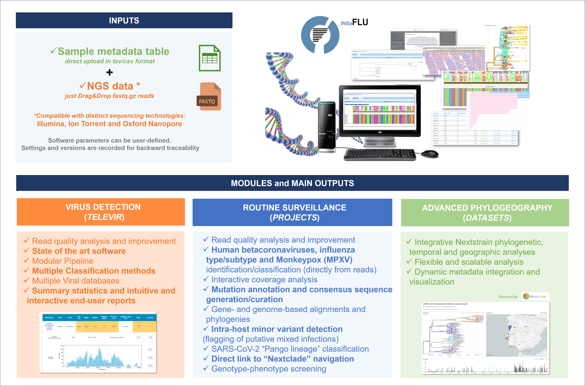

.. INSaFLU documentation master file, created by
   sphinx-quickstart on Thu Jan 11 09:25:25 2018.
   You can adapt this file completely to your liking, but it should at least
   contain the root `toctree` directive.

***********************************
Welcome to INSaFLU's documentation!
***********************************

.. image:: _static/logo.png

**INSaFLU-TELEVIR platform is a free bioinformatics web-based (but also locally installable) suite that deals with primary sequencing data (Illumina, Ion Torrent and Oxford Nanopore Technologies reads) towards:**

   -	**metagenomics virus detection** (from reads to virus detection) 

   -	**routine genomic surveillance** (from reads mutations detection, consensus generation, virus classification, alignments, “genotype-phenotype” screening, phylogenetics, integrative Nextstrain phylogeographical and temporal analysis etc). 

**INSaFLU-TELEVIR versatility and functionality is expected to supply public health laboratories and researchers with a user-oriented “start-to-end” bioinformatics framework that can potentiate a strengthened and timely detection and monitoring of viral (emerging) threats.**

- **Online tool:** https://insaflu.insa.pt
- **Documentation / Tutorial:** https://insaflu.readthedocs.io/en/latest/
- **Code:** https://github.com/INSaFLU/INSaFLU
- **Easy local installation:** https://github.com/INSaFLU/docker

Overview
++++++++++

How to Cite
+++++++++++

If you use INSaFLU in your work, please cite this publication:

Borges V, Pinheiro M et al. Genome Medicine (2018) 10:46

https://doi.org/10.1186/s13073-018-0555-0

Contact
+++++++

If you have any questions, comments or suggestions, please contact us: <vitor.borges@insa.min-saude.pt> or <j.paulo.gomes@insa.min-saude.pt>

*********
Contents
*********

.. toctree::
   :maxdepth: 2

   uploading_data.rst
   routine_genomic_surveillance.rst
   metagenomics_virus_detection.rst
   bioinformatics_pipeline.rst
   guide_pre_ngs.rst
   change_log.rst

