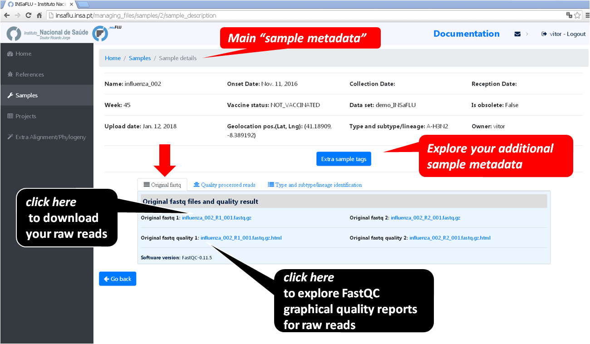
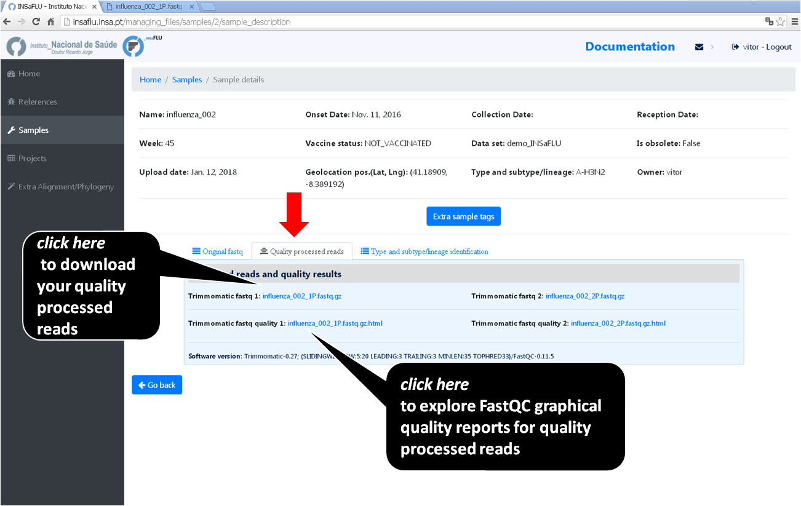
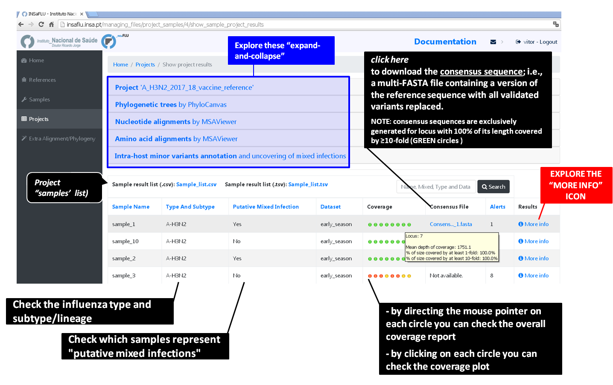
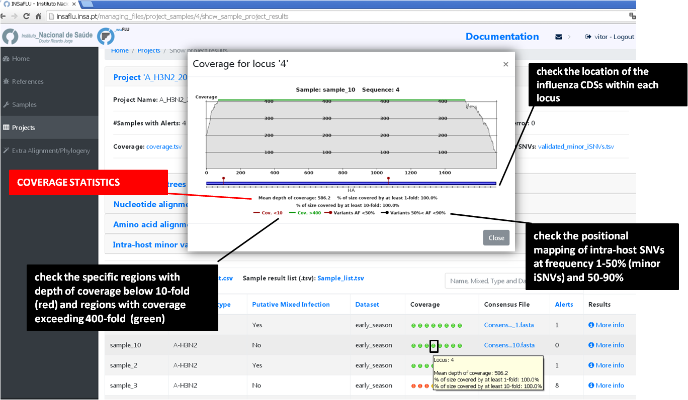
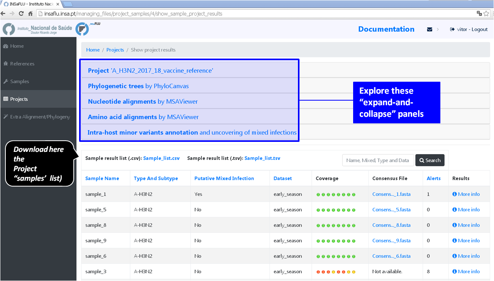
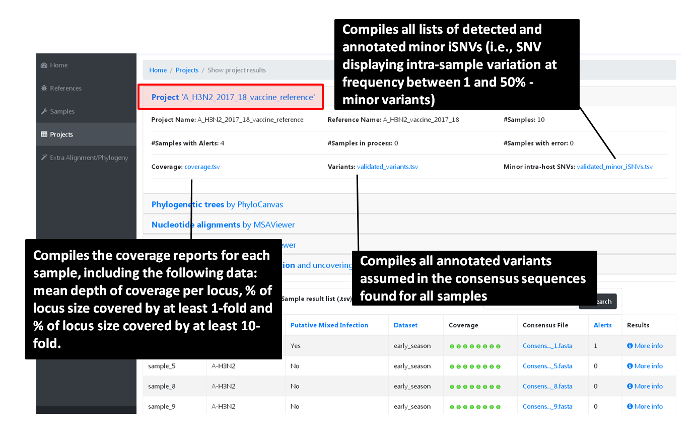
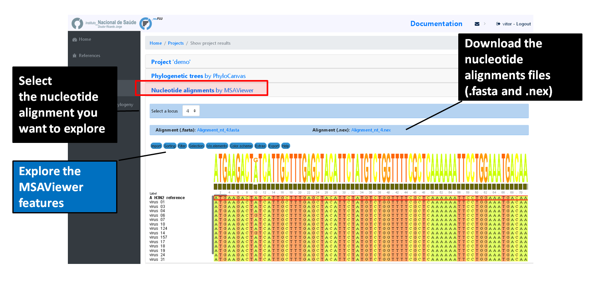
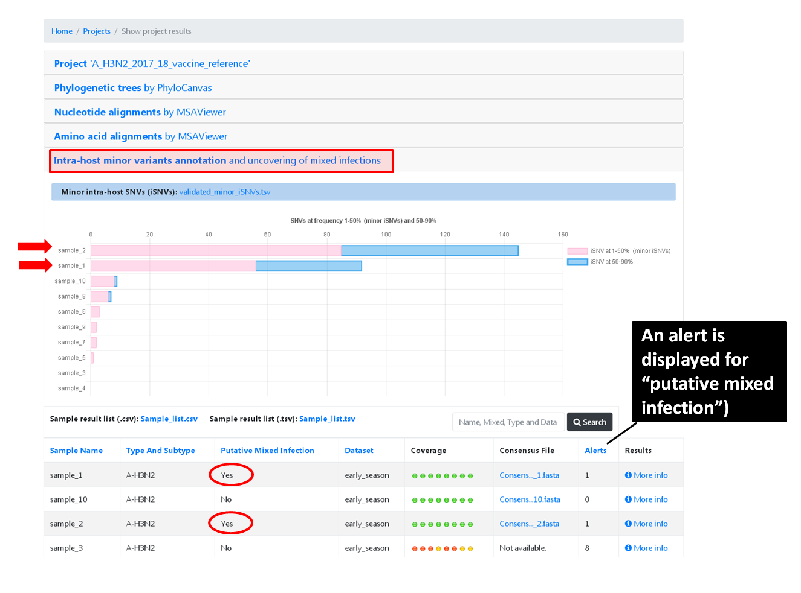

Output Visualization and Download
=================================

Upon project's launching, you can start exploring the diverse INSaFLU outputs, which include:

- **sample-specific outputs** (such as, mapping files, variants annotation and consensus sequences)

- **project outputs** (such as, nucleotide/amino acid alignments and phylogenetic trees). 

Outputs are organized by the dynamic “expand-and-collapse” panels that allow you a user-friendly visualization/download of all graphical, text and sequence output data. The following table provides an overview on all INSaFLU outputs organized by bioinformatics module:

:download:`INSaFLU_current_outputs_26_01_2022.xlsx <_static/INSaFLU_current_outputs_26_01_2022.xlsx>`
   

While navigating through INSaFLU menus, you will find which main software (including versions and settings) were used to generate outputs. The Sample list of each Project also also summarizes the software settings and user-defined cut-offs applied for each sample. 
 

Navigate through sample-specific outputs
++++++++++++++++++++++++++++++++++++++++
   

Explore the *Samples* menu
--------------------------  
   
This tab displays all information for all loaded samples.

A. Go to *Samples* menu and check the *reads' quality reports and typing data*
..............................................................................

Just after samples' metadata and NGS data submission, INSaFLU automatically updates samples' information with reads quality and typing data .
 
.. image:: _static/Samples_menu.png

B. Go to *Samples* menu and explore the *'More info' icon next to each sample*.
...............................................................................

By clicking on the 'More info' icon next to each sample, you can get an overview on the specific sample metadata and explore:

- **Graphical quality reports for raw read files** 

Click on ".html" files and explore each one of the FastQC (for Illumina/Ion Torrent data) or RabbitQC (for ONT data) "Analysis modules" - please consult https://www.bioinformatics.babraham.ac.uk/projects/fastqc/Help/3%20Analysis%20Modules/ and https://github.com/ZekunYin/RabbitQC for details]

.. image:: _static/sample_FastQC_report.png

- **Graphical quality reports for quality processed read files** 

Click on ".html" files and explore each one of the FastQC (for Illumina/Ion Torrent data) or RabbitQC (for ONT data) "Analysis modules" - please consult https://www.bioinformatics.babraham.ac.uk/projects/fastqc/Help/3%20Analysis%20Modules/ and https://github.com/ZekunYin/RabbitQC for details]

- **Typing and subtyping data**

.. image:: _static/sample_Type_subtype.png

.. note::
   - INSaFLU allows the discrimination of the influenza types A and B, all currently defined influenza A subtypes (18 hemagglutinin subtypes and 11 neuraminidase sub-types) and the two influenza B lineages (Yamagata and Victoria). 
   
   - INSaFLU flags samples as "putative mixed infections" if more than one type, HA or NA subtype or lineage is detected. In addition, specific alerts are generated if an incomplete type/subtype is assigned.
   
   As of March 10, 2020, INSaFLU was also upgraded for rapid classification and contigs assignment of Human Betacoronavirus (BetaCoV). 

- Assignment of viral segments/references to draft contigs

.. image:: _static/sample_Assign_segments2contigs.png

.. note::
   - INSaFLU performs automatic assignment of each assembled influenza-specific NODE (or contig) to both the corresponding viral segments and to a related reference influenza virus. 
   
 	- Outputs of this module (i.e., draft assemblies, the identified type and subtype/lineage and a table linking contigs to segments/references) can be visualize or downloaded here.

Explore the *Projects* menu
---------------------------  

This tab lists all your projects.

Multiple sample-specific outputs (see below) are generated when a given sample is processed within an specific Project. 

A. Go to *Projects* menu, and click on **"See results"** to explore outputs of a given project
..............................................................................................

Below the dynamic 'expand-and-collapse' panels, you can explore a table that contains multiple sample-specific outputs generated for each sample in a given project, including:

- **Type and subtype/lineage** 

- **Putative mixed infection**

- **Coverage report per locus** (interactive color-coded statistics and plots of the depth of coverage throughout each locus sequence)

- **Consensus sequence for the pool of loci** 

.. important::

   COVERAGE COLOR CODE:
	
   	GREEN: % of locus size covered by at least X-fold = 100%
   
   	YELLOW: % of locus size covered by at least X-fold is ≥ Y% and < 100%
   
  	RED: % of locus size covered by at least X-fold is < Y%
	
		
	X is the user-defined "mincov" value (i.e., the minimum number of reads covering a site to be considered for variant calling) selected for each project or sample (within a project) (default = 10)

	Y is the user-defined "Minimum percentage of locus horizontal coverage (with depth of coverage equal or above X) to generate consensus sequence" selected for each project or sample (within a project) (default = 70);

	(more details in **User-defined parameters** - https://insaflu.readthedocs.io/en/latest/data_analysis.html#user-defined-parameters)

NOTE: These novel color-code criteria (since 30 Oct 2020 update; see "Change log") are applied to all Projects and Samples, including samples within old projects (created before that update). Those old samples will remain unchanged (i.e., not masked in low coverage regions), unless the users re-run them with novel user-selected parameters. All updated samples will be flagged ("Calendar" icon) so that they can be differentiated from those keeping originally applied parameters (exactly as described in the original publication).

By clicking on each one of the color-coded circles, you can explore locus-specific plots of the depth of coverage. 

B. Go to *Projects* menu, click on **"See results"** and explore the **"More info"** icon next to each sample
.............................................................................................................

By clicking on the 'More info' icon next to each sample, you can get an overview on the specific sample metadata and additionally download/explore:

- **Type and subtype/lineage**

- **Mapping file** 

- **Consensus sequence for the pool of loci** 
	
- **Annotated variants (SNPs and indels)**

.. warning::

  - Validated variants falling within loci not fully covered with ≥ ”mincov”-fold (color-coded as yellow or red) are still included in the "validated_variants" list (these cases are labeled in the table column "VARIANTS in INCOMPLETE LOCUS" as YES), so that users can still retrieve valuable and reliable data (e.g., specific epitope and antiviral drug resistance mutations) from samples with low or borderline coverage.
  
- Consensus sequences are exclusively generated for individual locus with 100% of its length covered by at least X-fold (GREEN code in the graphical coverage report) or when the % of locus size covered by at least X-fold is ≥ Y% and < 100% (YELLOW code in the graphical coverage report).

	X is the user-defined "mincov" value (i.e., the minimum number of reads covering a site to be considered for variant calling) selected for each project or sample (within a project) (default = 10)

	Y is the user-defined "Minimum percentage of locus horizontal coverage (with depth of coverage equal or above X) to generate consensus sequence" value selected for each project or sample (within a project) (default = 70);

	(more details in **User-defined software parameterization**)

.. image:: _static/sample_projects_extra_info.png

By clicking on "Mapping file by IGV (Explore 'sample.bam' file), you can finely inspect the mapped reads (and variants) using the Integrative Genomics Viewer (IGV)

.. image:: _static/sample_projects_extra_info_IGV.png

Navigate through global *Projects* outputs
++++++++++++++++++++++++++++++++++++++++++
   

Explore the *Projects menu ("See results" icon)*
------------------------------------------------ 

The *Projects* tab lists all your projects. 

Click on **"See results"** to explore outputs of a given project 

The projects outputs are organized by dynamic 'expand-and-collapse' panels containing project-specific outputs (see how to explore each one below). At the bottom of these panels you can explore sample-specific outputs and download the current list of samples. 

.. note::
   The project samples' list ("Sample_list" file) is automatically re-build and cumulatively updated as more samples are added to the project. This file compiles all samples' metadata as well as sample-specific additional data provided by INSaFLU ("type and subtype/lineage" and "putative mixed infection" data)

The "Sample_list" file can be uploaded, together with associated alignment or phylogenetic data, to visualization tools (see more details on the tab **Uploading data / Uploading Sample metadata and NGS data**)

A. Click on the panel **Project 'Project_name'** to get an overview on the project
..................................................................................

Within this panel you can get an overview on the project (e.g., number of samples processed, reference used, etc), and download project-specific outputs:

- Global **Coverage report** 

- **List of all validated variants (SNPs and indels)** 

- **List of all minor intra-host single nucleotide variants (iSNVs)**

.. note::
   These tables are automatically re-build and cumulatively updated as more samples are added to the project.

.. warning::
   - Validated mutations falling within loci not fully covered with ≥ ”mincov”-fold (color-coded as yellow or red) are still included in the "validated_variants" list (these cases are labeled in the table column "VARIANTS in INCOMPLETE LOCUS" as YES), so that users can still retrieve valuable and reliable data (e.g., specific epitope and antiviral drug resistance mutations) from samples with low coverage in some regions or even borderline coverage .

B. Navigate through **Phylogenetic trees** and Explore your metadata
....................................................................

Within this panel you can explore the "whole-genome"-based ("All") and locus-specific phylogenetic trees

.. note::
   Phylogenetic trees are automatically re-build and cumulatively updated as more samples are added to the project.
   
   The Reference virus is included in each phylogenetic tree by default.
   
   Trees are only built when projects have more than one sample.
   

.. image:: _static/projects_phylogenetic_trees.png

.. warning::

- Each locus-specific tree exclusively enrolls samples color-coded as GREEN or YELLOW for the respective locus in the coverage interactive report (see meaning above).

- The genome-based phylogenetic tree ("All") exclusively enrolls samples having all loci color-coded as GREEN or YELLOW in the coverage interactive report.

If you have uploaded rich sample metadata, you can now easily color tree nodes and/or display colored metadata blocks next to the tree according to any combination of metadata variables. This largely facilitates the visualization, exploration and interpretation of your phylogenetic data, while potentiating the association/integration of relevant epidemiological and/or clinical data and pathogen genomic data towards an enhanced laboratory surveillance.

Instructions:

.. image:: _static/insaphylogeo_instructions_1.png

Examples:

.. image:: _static/insaphylogeo_1.png

.. image:: _static/insaphylogeo_2.png

C. Navigate through **Mutation list** 
....................................................................

Within this panel you can explore the list of all validated mutations (SNPs and indels) assumed in the consensus sequences of all samples within the project. It can filter by any item (e.g., sample, aa change, etc) and download the sub-table with the filtered rows.

D. Navigate through **Nucleotide alignments by MSAViewer**
..........................................................

Within this panel you can explore the "whole-genome"-based ("All") and locus-specific nucleotide alignments 

.. note::
   Nucleotide alignments are automatically re-build and cumulatively updated as more samples are added to the project.
   
   The Reference sequence is included in each alignment. 
   
   Alignments are only built when projects have more than one sample.

.. warning::
   
   - Each locus-specific alignment exclusively enrolls samples color-coded as GREEN or YELLOW for the respective locus in the coverage interactive report (see meaning above).   
   
   - The genome-based nucleotide alignment ("All") exclusively enrolls samples having all loci color-coded as GREEN or YELLOW in the coverage interactive report.

E. Navigate through **Amino acid alignments by MSAViewer**
..........................................................

Within this panel you can explore the amino acid alignments for the influenza protein 

.. note::
   Amino acid alignments are automatically re-build and cumulatively updated as more samples are added to the project.
   
   The Reference sequence is included in each alignment.
   
   Alignments are only built when projects have more than one sample.

.. image:: _static/projects_amino_acid_alignments.png

.. warning::
  
  - Each locus-specific amino acid alignment exclusively enrolls samples color-coded as GREEN or YELLOW for the respective locus in the coverage interactive report (see meaning above). For YELLOW cases (i.e. incomplete locus), undefined amino acids (“X”) are automatically introduced in low coverage regions at a user-selected coverage thresholds. **NOTE: Protein alignments only include samples with < 10% of undefined amino acids (X).**
   
F. Explore the **Intra-host minor variants annotation (and uncovering of putative mixed infections)** panel
...........................................................................................................

Within this panel you can explore a graph plotting the proportion of iSNV at frequency at 1-50%  (minor iSNVs) and at frequency 50-90%, and download the list of all detected and annotated minor iSNVs (i.e., SNV displaying intra-sample variation at frequency between 1 and 50% - minor variants) for the project.

.. note::
   Both the graph and the list of validated minor iSNVs are automatically re-build and cumulatively updated as more samples are added to the project 

You may inspect this plot to uncover infections with influenza viruses presenting clearly distinct genetic backgrounds (so called **'mixed infections'**). A cumulative high proportion of iSNVs at both frequency' ranges is mostly likely to represent a mixed infection, in a sense that the natural intra-patient influenza diversification (that NGS is capable of detecting) is expected to be very low (no more than a few tenths of variants, most of them at frequency <10%)

.. important::
   - INSaFLU flags samples as 'putative mixed infections' based on intra-host SNVs if the following cumulative criteria are fulfilled: the ratio of the number of iSNVs at frequency 1-50% (minor iSNVs) and 50-90% falls within the range 0,5-2,0 and the sum of the number of these two categories of iSNVs exceeds 20. Alternatively, to account for mixed infections involving extremely different viruses (e.g., A/H3N2 and A/H1N1), the flag is also displayed when the sum of the two categories of iSNVs exceeds 100, regardless of the first criterion.
   
   - Note that samples can also be flagged as "putative mixed infections" if if more than one type, HA or NA subtype or lineage is detected (see "Type and subtype identification" module). 

.. warning::
   - By default, samples flagged as "putative mixed infections" are depicted in both alignments and phylogenetic trees. Users are encouraged to inspect the flagged samples by exploring their mapping files (.bam files), "coverage" plots per locus and also the lists of variants. 

G. Explore the **Coverage for all samples** panel
...........................................................................................................

This panel provides an additional interactive color-coded coverage report, summarizing the mean depth of coverage and horizontal coverage per locus for all samples within a project.

COVERAGE COLOR CODE:
	
   	GREEN: % of locus size covered by at least X-fold = 100%
   
   	YELLOW: % of locus size covered by at least X-fold is ≥ Y% and < 100%
   
  	RED: % of locus size covered by at least X-fold is < Y%
	
		
	X is the user-defined "mincov" value (i.e., the minimum number of reads covering a site to be considered for variant calling) selected for each project or sample (within a project) (default = 10)

	Y is the user-defined "Minimum percentage of locus horizontal coverage (with depth of coverage equal or above X) to generate consensus sequence" selected for each project or sample (within a project) (default = 70);

	(more details in **User-defined parameters** - https://insaflu.readthedocs.io/en/latest/data_analysis.html#user-defined-parameters)

NOTE: These novel color-code criteria (since 30 Oct 2020 update; see "Change log") are applied to all Projects and Samples, including samples within old projects (created before that update). Those old samples will remain unchanged (i.e., not masked in low coverage regions), unless the users re-run them with novel user-selected parameters. All updated samples will be flagged ("Calendar" icon) so that they can be differentiated from those keeping originally applied parameters (exactly as described in the original publication).

By clicking on each one of the color-coded rectangle, you can explore locus-specific plots of the depth of coverage. 

H. Explore the **Algn2pheno report** panel and results
...........................................................................................................

Within this panel you can explore the results of the Algn2pheno module that screens mutations of interest in the Spike amino acid sequences of samples in projects that have a SARS-CoV-2 reference sequence.

Algn2pheno uses two databases for screening: Pokay database and COG-UK Antigenic Mutations database. By default, the Algn2pheno report panel shows the screening results (corresponding to the output file "_final_report.tsv" described below) obtained using the COG-UK Antigenic Mutations database.

This interactive table can be filtered by any item (e.g., sample, aa change, etc.) and the filtered rows can be downloaded as a sub-table.

By clicking on the "Download" button in the Project results page, it is possible to download the full set of Algn2pheno outputs:

- **_final_report.tsv**: provides the list of samples analysed, their repertoire of "Flagged mutations" (i.e., database mutations that were detected in the alignment), the "phenotypes" that are supported by those mutations of interest and the list of "All mutations" detected for each sequence. This report is provided for the two default databases used (Pokay and COG-UK Antigenic Mutations).

- **_flagged_mutation_report.tsv**: "Flagged mutation" binary matrix for all sequences and the "associated" phenotypes. This report is provided for the two default databases used (Pokay and COG-UK Antigenic Mutations).

- **algn2pheno.log**: alg2pheno log file with tool version and useful links, description of databases used and respective sources, as well as description of outputs.

Navigate through Nextstrain *Datasets*
++++++++++++++++++++++++++++++++++++++++

The *Datasets* tab lists all your Nextstrain Datasets, organized by the available builds (more info here: https://insaflu.readthedocs.io/en/latest/data_analysis.html#nextstrain-datasets)

Click in **Results"** to explore outputs of a given Dataset.

The *Dataset* outputs are available through the **Download** button and dynamic **'expand-and-collapse' panels**:

Explore the *Dataset* outputs
-------------------------------

A. Explore the main Nextstrain output (JSON file) using auspice.us
..................................................................................

The **Download** button provides:

- **auspice.json** (zipped): the JSON files within this compressed file are the **main outputs** of the *Datasets* module, compiling the results of the Nextstrain integrative phylogenetic, temporal and geographic analyses.

- **Dataset list** (csv/tsv format): this file compiles all metadata of the sequences included in the Dataset (included their source: References, Projects or External sequences) as well as additional data provided by INSaFLU ("type and subtype/lineage" and "putative mixed infection" data)

- **Nextstrain metadata** (tsv format): same metadata file as the "Dataset list", but with columns/headers compatible with the Nextstrain build (and the output JSON files).

- **Sequences** (AllConsensus.fasta): compiles all sequences included in the *Dataset* 

.. note::

- To visualize the *Dataset* outputs, **download the JSON files and drag-and drop the files in https://auspice.us/.**

- You can also **drag-and drop the nextstrain metadata file (Nextstrain_matadata.tsv) in auspice.us* to update the displayed metadata. The downloaded metadata file can be enriched with additional information to have an enhanced visualization and exploration of phylogeographic and temporal data. With https://auspice.us/, your datasets are visualised client-side in the browser -- no data is transmitted, and no tracking cookies are used. 

- When more samples are added to the Dataset, the metadata file and JSON files are automatically re-build and cumulatively updated.

.. important::
	**To take advantage of temporal and geographical features of Nextstrain**, please make sure you provide:
	
	- **"collection date"** for all samples added to Nextstrain datasets. If no collection date is provided, INSaFLU will automatically insert the date of the analysis as the "collection date", which might (considerably) bias (or even break) the time-scale trees generated for influenza, SARS-CoV-2 and Monkeypox.
	
	- **"region", "country", "division" and/or "location"** columns in the metadata. These values will be screened against a vast database of "latitude and longitude" coordinates (https://github.com/INSaFLU/nextstrain_builds/blob/main/generic/config/lat_longs.tsv) to geographically place the sequences in the Nextstrain map.

	To add/update the metadata of samples previously uploaded to INSaFLU, please follow these instructions: https://insaflu.readthedocs.io/en/latest/uploading_data.html#updating-sample-metadata

B. Navigate through **Phylogenetic trees** and Explore your metadata
......................................................................

Within this panel, as a complement of https://auspice.us/ visualization, you can also visualize the Nextstrain *Divergence* tree and associated metadata using Phylocanvas (http://phylocanvas.org/).

.. note::
   Phylogenetic trees are automatically re-build and cumulatively updated as more samples are added to the Dataset.
   
   Trees are only built when projects have more than one sample.
   

.. image:: _static/projects_phylogenetic_trees.png

Instructions:

.. image:: _static/insaphylogeo_instructions_1.png

Examples:

.. image:: _static/insaphylogeo_1.png

.. image:: _static/insaphylogeo_2.png

C. Navigate through **Nucleotide alignments by MSAViewer**
...........................................................

Within this panel, you can explore the Nextstrain nucleotide alignment used to derive the phylogeny.

.. note::
   Nucleotide alignments are automatically re-build and cumulatively updated as more samples are added to the project.
      
   Alignments are only built when datasets have more than one sample.

.. warning::
   
   - Each locus-specific alignment exclusively enrolls samples color-coded as GREEN or YELLOW for the respective locus in the coverage interactive report (see meaning above).   
   
   - The genome-based nucleotide alignment ("All") exclusively enrolls samples having all loci color-coded as GREEN or YELLOW in the coverage interactive report.

