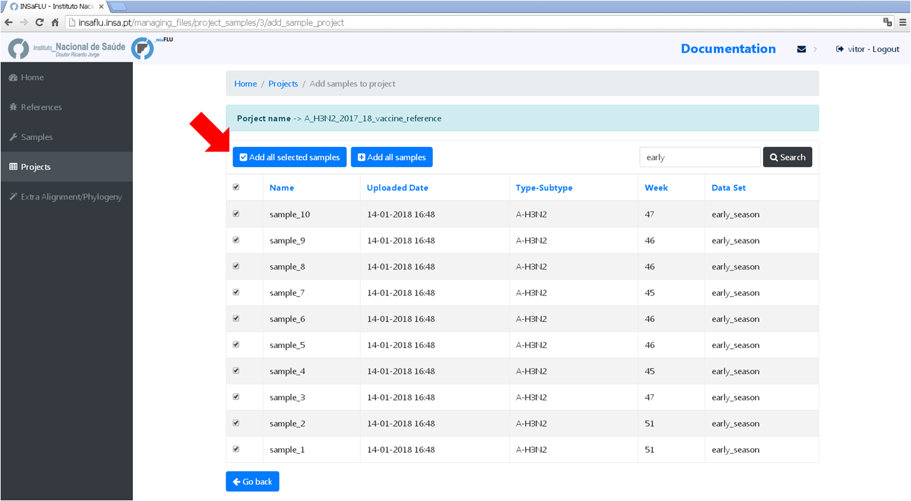
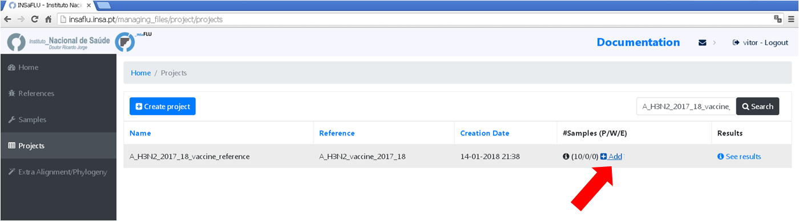

Project creation and scaling-up
===============================

One of the main goals of INSaFLU is to make data integration completely flexible and scalable in order to fulfill the analytical demands underlying laboratory surveillance throughout each flu epidemics. As such, INSaFLU allows users to create several projects (each one including multiple user-selected samples) and add more samples to each one as needed. In a dynamic manner, project outputs (e.g., gene- and genome-based alignments and phylogenetic trees) are automatically re-build and cumulatively updated as more samples are added to each project. The outputs are provided to be compatible with multiple downstream applications.

Creating a new project
++++++++++++++++++++++

You may create two types of projects at INSaFLU: **"Projects" (A)** and **"Extra Alignment/Phylogeny" (B)**

A. Creating and scaling-up a whole workflow Project
-------------------------------------------------------

Within the *Projects* menu, you run the whole INSaFLU bioinformatics pipeline:

1. Go to *Projects* menu and choose *Create project*
....................................................

You are encouraged to create “umbrella” projects, such as projects enrolling same sub-type viruses from the same season that will be compared with the vaccine reference virus for a given flu season. 

You can designate the projects so that the name easily indicates the combination “virus sub-type/season/reference” (e.g. **A_H3N2_2017_18_vaccine_ref**)

.. image:: _static/create_project_1_create.png

2. Choose a *Project Name*, select a *Reference sequence* and *Save*
......................................................................

.. note::
   You should select a reference sequence (e.g., the vaccine strain from the current influenza season) that fits both your amplicon design (i.e., a multi-fasta file containing the set of reference sequences with the precise size of each “intra-amplicon” target sequence that you capture by each one of the RT-PCR amplicons) and the set of samples that will be compared (e.g., same sub-type viruses from the same season to be compared with the vaccine reference virus).

.. image:: _static/create_project_2_name_ref.png

3. Add the **samples** to be included in the **project**
........................................................

Samples are processed immediately upon selection, so, at this time, users may start monitoring the Project progress by checking the number of samples in the following status: Processed (P); Waiting (W) and Error (E).

.. image:: _static/monitoring_project_status.png

4. Scale-up your **project**. 
.............................

You may add more samples to your **Project** project at any time.

B. Creating a Extra Alignment/Phylogeny project (this module will be AVAILABLE SOON!)
-------------------------------------------------------------------------------------

Within the *Extra Alignment/Phylogeny* menu, you can generate additional nucleotide alignments and phylogenetic trees over a set of user-selected sequences in an independent manner. This module provides a huge flexibility as you can evaluate and integrate the genetic diversity of circulating viruses according to your specific needs. For instance, you can perform extra gene- or whole-genome-scale alignment/phylogenetic analyses enrolling: 

	i. particular subsets of samples from a given project (e.g., subset of viruses from a specific genetic clade or subsets excluding samples flagged as “putative mixed infection”)
	
	ii. viruses from different seasons processed in different projects
	
	iii. your viruses under study and also extra representative virus of specific genetic (sub)groups/clades/lineages as defined by supranational health authorities guidelines (e.g., ECDC) for each season (you may pre-uploaded these sequences using the Reference menu)
 

1. Go to *Extra Alignment/Phylogeny* menu and choose *Create project* (AVAILABLE SOON)
......................................................................................

Select the sequences to be included in the project. You may choose sequences from both the *reference database* and a *sequence repository* that includes all validated consensus sequences generated in the user-restricted “whole workflow” projects.

Monitoring Projects' progress
+++++++++++++++++++++++++++++

INSaFLU projects are automatically run upon creation. So, at this time, users may start monitoring the Project progress by checking the number of samples in the following status: Processed (P); Waiting (W) and Error (E).

.. image:: _static/monitoring_project_status.png

