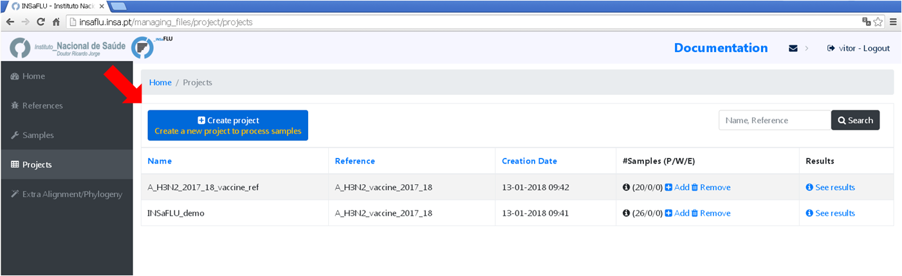
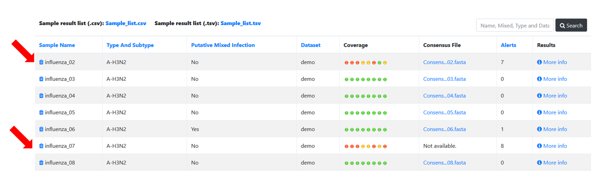

Project / Dataset creation and scaling-up
==========================================

One of the main goals of INSaFLU is to make data integration completely flexible and scalable in order to fulfill the analytical demands underlying routine genomic surveillance throughout viral epidemics. As such, INSaFLU allows users to create several projects or datasets and add more samples to each one as needed. In a dynamic manner, project / dataset outputs are automatically re-build and cumulatively updated as more samples are added to each project / dataset. The outputs are provided to be compatible with multiple downstream applications.

INSaFLU allows running:

**Projects** - From reads to reference-based generation of consensus sequences and mutations annotation, followed by gene- and genome-based alignments, amino acid alignments, Pango classification, NextClade linkage, etc.

**Datasets** - From consensus sequences to advanced Nextstrain phylogenetic and genomic analysis, coupled with geographic and temporal data visualization and exploration of sequence metadata.

**Project** - Creation and scale-up
+++++++++++++++++++++++++++++++++++++

**Projects** - From reads to reference-based generation of consensus sequences and mutations annotation, followed by gene- and genome-based alignments, amino acid alignments, Pango classification, NextClade linkage, etc.

Within the *Projects* menu:

1. Go to *Projects* menu and choose *Create project*
....................................................

You are encouraged to create “umbrella” projects, such as projects enrolling same sub-type viruses from the same season that will be compared with the vaccine reference virus for a given flu season. 

You can designate the projects so that the name easily indicates the combination “virus sub-type/season/reference” (e.g. **A_H3N2_2017_18_vaccine_ref**)

2. Choose a *Project Name*, select a *Reference sequence* and *Save*
......................................................................

.. important::
   You should select a reference sequence (e.g., the vaccine strain from the current influenza season) that fits both your amplicon design (i.e., a multi-fasta file containing the set of reference sequences with the precise size of each “intra-amplicon” target sequence that you capture by each one of the RT-PCR amplicons) and the set of samples that will be compared (e.g., same sub-type viruses from the same season to be compared with the vaccine reference virus).

.. image:: _static/create_project_2_name_ref.png

3. Choose the software parameters to be applied to the project.
.................................................................

After creating a project, and before adding the first sample, you can clicking in the "Magic wand" to select the parameters to be applied by default to every sample added to the project. 

Note: Please set the parameters before assigning the first sample to the project. After that, you are still allowed to change the parameters for individual samples within the Project. Updated samples are automatically re-analysed using the novel parameters and re-inserted in the Project. 

4. Add the **samples** to be included in the **project**
........................................................

.. image:: _static/create_project_3_add_samples.png

Samples are processed immediately upon selection, so, at this time, users may start monitoring the Project progress by checking the number of samples in the following status: Processed (P); Waiting (W) and Error (E).

.. image:: _static/monitoring_project_status.png

5. Monitoring Projects' progress
...............................

INSaFLU projects are automatically run upon creation. So, at this time, users may start monitoring the Project progress by checking the number of samples in the following status: Processed (P); Waiting (W) and Error (E).

.. image:: _static/monitoring_project_status.png

6. Scale-up your **project**. 
.............................

You may add more samples to your **Project** project at any time.

.. image:: _static/create_project_4_scale_up.png

7. Modify software parameters for a given sample within a Project
..................................................................

Users can change the mapping parameters for individual samples within a Project. The sample is automatically re-analysed using the novel parameters and re-inserted in the Project (outputs are automatically re-calculated to integrate the “updated” sample). For instance, if the updated sample fulfill the criteria for consensus generation with the novel settings, it will be automatically integrated in the alignments and trees.

NOTE: Users can also re-run samples (with user-selected parameters) included in projects created before the 30 Oct 2020 update (see "Change log"). The updated samples will be flagged accordingly. 

8. Remove samples from your **project**. 
........................................

You may want to remove some samples from your project (e.g., for exclusively keeping samples with success for all 8 locus) 

 
 
 **Datasets** - Creation and scale-up
++++++++++++++++++++++++++++++++++++++

**Datasets** - From consensus sequences to advanced Nextstrain phylogenetic and genomic analysis, coupled with geographic and temporal data visualization and exploration of sequence metadata.

More details here: https://insaflu.readthedocs.io/en/latest/data_analysis.html#nextstrain-datasets and https://github.com/INSaFLU/nextstrain_builds

Within the *Datasets* menu:

1. Go to *Datasets* menu and choose *New Dataset*
....................................................

2. Choose a *Dataset Name* and *Save*
......................................................................

3. Choose the Nextstrain build
...................................

After creating a Dataset, and before adding the first sample, you can clicking in the "Magic wand" to select the Nextstrain build that will be run.

INSaFLU allows launching virus-specific Nextstrain builds (seasonal Influenza, SARS-CoV-2 and Monkeypox) as well as a "generic" build that can be used for any pathogen.

More details here: https://github.com/INSaFLU/nextstrain_builds

*Builds*

**Influenza**

INSaFLU allows running four Nexstrain builds for the seasonal influenza (A/H3N2, A/H1N1/, B/Victoria and B/Yamagata), which are simplified versions of the Influenza Nextstrain builds available at https://github.com/nextstrain/seasonal-flu

So far, influenza analyses are restricted to the Hemagglutinn (HA) coding gene. The reference HA sequences used for site (nucleotide  / amino acid) numbering in the output JSON files are:

- H1N1PDM: A/California/07/2009(H1N1) (https://www.ncbi.nlm.nih.gov/nuccore/CY121680.1/)
- H3N2: A/Beijing/32/1992 (https://www.ncbi.nlm.nih.gov/nuccore/U26830.1/)
- VIC: Influenza B virus (B/Hong Kong/02/1993) (https://www.ncbi.nlm.nih.gov/nuccore/CY018813.1/)
- YAM: Influenza B virus (B/Singapore/11/1994) (https://www.ncbi.nlm.nih.gov/nuccore/CY019707.1/)

**SARS-CoV-2**

This build is a simplified version of the SARS-CoV-2 Nextstrain build available at https://github.com/nextstrain/ncov

The reference genome used for site (nucleotide  / amino acid) numbering and genome structure in the output JSON files is:

- Wuhan-Hu-1/2019 (https://www.ncbi.nlm.nih.gov/nuccore/MN908947)

**Monkeypox virus**

This build is a simplified version of the Monkeypox virus Nextstrain build available at https://github.com/nextstrain/monkeypox

The reference genome used for site (nucleotide  / amino acid) numbering and genome structure in the output JSON files is:

- MPXV-M5312_HM12_Rivers (https://www.ncbi.nlm.nih.gov/nuccore/NC_063383)

**Generic**

This build is a simplified version of the Nextstrain build available at https://github.com/nextstrain/zika

This generic build uses as reference sequence (as tree root and for mutation annotation) one of the reference sequences of the projects included in the Nextstrain dataset.

Currently, the generic build does not generate a Time-Resolved Tree (unlike the virus-specific builds).

.. important::
	**To take advantage of temporal and geographical features of Nextstrain**, please make sure you provide:
	
	- **"collection date"** for all samples added to Nextstrain datasets. If no collection date is provided, INSaFLU will automatically insert the date of the analysis as the "collection date", which might (considerably) bias (or even break) the time-scale trees generated for influenza, SARS-CoV-2 and Monkeypox.
	
	- **"region", "country", "division" and/or "location"** columns in the metadata. These values will be screened against a vast database of "latitude and longitude" coordinates (https://github.com/INSaFLU/nextstrain_builds/blob/main/generic/config/lat_longs.tsv) to geographically place the sequences in the Nextstrain map.

	To add/update the metadata of samples previously uploaded to INSaFLU, please follow these instructions: https://insaflu.readthedocs.io/en/latest/uploading_data.html#updating-sample-metadata

4. Add the *samples* to be included in the *Dataset*
........................................................

You can add samples to the Dataset from different sources:

- **References** - user-selected references sequences available in the References repository

- **Projects** - user-selected consensus sequences generated within INSaFLU projects

- **External sequences** - to upload external sequences, click in "Add your onw consensus", followed by "Upload new consensus". You can upload FASTA or MULTI-FASTA files. Please make sure that the upload sequences match the respective build (e.g., genome sequences for SARS-CoV-2 Nextstrain build or HA sequences for influenza Nextstrain builds).

5. Scale-up your **dataset**. 
.............................

6. Remove samples from your *Datasets*. 
........................................

You may remove some samples from your Dataset
  

