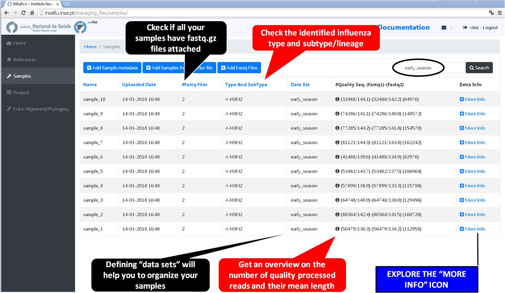
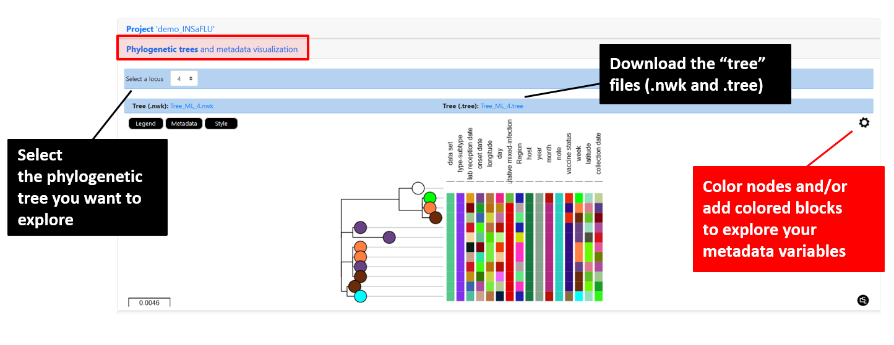
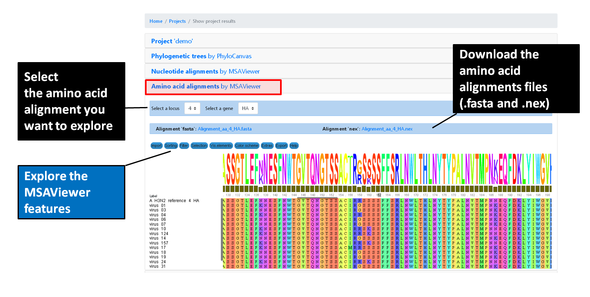

**Reference-based genomic surveillance**
=========================================

The surveillance-oriented component of INSaFLU allows running:

**INSaFLU Projects** - From reads to reference-based generation of consensus sequences and mutations annotation, followed by gene- and genome-based alignments, amino acid alignments, Pango classification, NextClade linkage, etc.

**Nextstrain Datasets** - From consensus sequences to advanced Nextstrain phylogenetic and genomic analysis, coupled with geographic and temporal data visualization and exploration of sequence metadata.

One of the main goals of INSaFLU is to make data integration completely flexible and scalable in order to fulfill the analytical demands underlying routine genomic surveillance throughout viral epidemics. As such, INSaFLU allows users to create several projects or datasets and add more samples to each one as needed. In a dynamic manner, project / dataset outputs are automatically re-build and cumulatively updated as more samples are added to each project / dataset. The outputs are provided to be compatible with multiple downstream applications.

**INSaFLU Projects** - How to create and scale-up a genomic surveillance project
+++++++++++++++++++++++++++++++++++++++++++++++++++++++++++++++++++++++++++++++++

**Projects** - From reads to reference-based generation of consensus sequences and mutations annotation, followed by gene- and genome-based alignments, amino acid alignments, Pango classification, NextClade linkage, etc.

Within the *Projects* menu:

1. Go to *Projects* menu and choose *Create project*
....................................................

You are encouraged to create “umbrella” projects, such as projects enrolling same sub-type viruses from the same season that will be compared with the vaccine reference virus for a given flu season. 

You can designate the projects so that the name easily indicates the combination “virus sub-type/season/reference” (e.g. **A_H3N2_2017_18_vaccine_ref**)

.. image:: _static/create_project_1_create.png

2. Choose a *Project Name*, select a *Reference sequence* and *Save*
......................................................................

.. important::
   You should select a reference sequence (e.g., the vaccine strain from the current influenza season) that fits both your amplicon design (i.e., a multi-fasta file containing the set of reference sequences with the precise size of each “intra-amplicon” target sequence that you capture by each one of the RT-PCR amplicons) and the set of samples that will be compared (e.g., same sub-type viruses from the same season to be compared with the vaccine reference virus).

3. Choose the software parameters to be applied to the project.
.................................................................

After creating a project, and before adding the first sample, you can clicking in the "Magic wand" to select the parameters to be applied by default to every sample added to the project. 

Note: Please set the parameters before assigning the first sample to the project. After that, you are still allowed to change the parameters for individual samples within the Project. Updated samples are automatically re-analysed using the novel parameters and re-inserted in the Project. 

4. Add the **samples** to be included in the **project**
........................................................

.. image:: _static/create_project_3_add_samples.png

Samples are processed immediately upon selection, so, at this time, users may start monitoring the Project progress by checking the number of samples in the following status: Processed (P); Waiting (W) and Error (E).

5. Monitoring Projects' progress
.................................

INSaFLU projects are automatically run upon creation. So, at this time, users may start monitoring the Project progress by checking the number of samples in the following status: Processed (P); Waiting (W) and Error (E).

6. Scale-up your **project**. 
.............................

You may add more samples to your **Project** project at any time.

.. image:: _static/create_project_4_scale_up.png

7. Modify software parameters for a given sample within a Project
..................................................................

Users can change the mapping parameters for individual samples within a Project. The sample is automatically re-analysed using the novel parameters and re-inserted in the Project (outputs are automatically re-calculated to integrate the “updated” sample). For instance, if the updated sample fulfill the criteria for consensus generation with the novel settings, it will be automatically integrated in the alignments and trees.

NOTE: Users can also re-run samples (with user-selected parameters) included in projects created before the 30 Oct 2020 update (see "Change log"). The updated samples will be flagged accordingly. 

8. Remove samples from your **project**. 
........................................

You may want to remove some samples from your project (e.g., for exclusively keeping samples with success for all 8 locus) 

.. image:: _static/create_project_5_remove_samples.png

 
**Nextstrain Datasets** - How to create and run Nextstrain datasets
++++++++++++++++++++++++++++++++++++++++++++++++++++++++++++++++++++

**Datasets** - From consensus sequences to advanced Nextstrain phylogenetic and genomic analysis, coupled with geographic and temporal data visualization and exploration of sequence metadata.

More details here: https://insaflu.readthedocs.io/en/latest/data_analysis.html#nextstrain-datasets and https://github.com/INSaFLU/nextstrain_builds

Within the *Datasets* menu:

1. Go to *Datasets* menu and choose *New Dataset*
....................................................

2. Choose a *Dataset Name* and *Save*
......................................................................

3. Choose the Nextstrain build
...................................

After creating a Dataset, and before adding the first sample, you can clicking in the "Magic wand" to select the Nextstrain build that will be run.

INSaFLU allows launching virus-specific Nextstrain builds (seasonal Influenza, SARS-CoV-2 and Monkeypox) as well as a "generic" build that can be used for any pathogen.

More details here: https://github.com/INSaFLU/nextstrain_builds

*Builds*

**Seasonal influenza**

INSaFLU allows running four Nexstrain builds for the seasonal influenza (A/H3N2, A/H1N1/, B/Victoria and B/Yamagata), which are simplified versions of the Influenza Nextstrain builds available at https://github.com/nextstrain/seasonal-flu

So far, influenza analyses are restricted to the Hemagglutinn (HA) coding gene. The reference HA sequences used for site (nucleotide  / amino acid) numbering in the output JSON files are:

- H1N1PDM: A/California/07/2009(H1N1) (https://www.ncbi.nlm.nih.gov/nuccore/CY121680.1/)
- H3N2: A/Beijing/32/1992 (https://www.ncbi.nlm.nih.gov/nuccore/U26830.1/)
- VIC: Influenza B virus (B/Hong Kong/02/1993) (https://www.ncbi.nlm.nih.gov/nuccore/CY018813.1/)
- YAM: Influenza B virus (B/Singapore/11/1994) (https://www.ncbi.nlm.nih.gov/nuccore/CY019707.1/)

**Avian influenza** (under construction)

INSaFLU allows running Nexstrain builds for the avian influenza (A/H5N1), which are a simplified version of the Nextstrain builds available at https://github.com/nextstrain/avian-flu

So far, Nextstrain avian influenza can be launched for the Hemagglutinn (HA), Neuraminidase (NA) and polymerase protein PB2 (PB2) coding genes. The reference sequences used for site (nucleotide  / amino acid) numbering in the output JSON files are:

- HA: Influenza A virus (A/Goose/Guangdong/1/96(H5N1)) hemagglutinin (HA) (https://www.ncbi.nlm.nih.gov/nuccore/AF144305.1/)
- NA: Influenza A virus (A/Goose/Guangdong/1/96(H5N1)) neuraminidase (NA) (https://www.ncbi.nlm.nih.gov/nuccore/AF144304.1)
- PB2: Influenza A virus (A/Goose/Guangdong/1/96(H5N1)) polymerase (PB2)(https://www.ncbi.nlm.nih.gov/nuccore/AF144300.1)

**SARS-CoV-2**

This build is a simplified version of the SARS-CoV-2 Nextstrain build available at https://github.com/nextstrain/ncov

The reference genome used for site (nucleotide  / amino acid) numbering and genome structure in the output JSON files is:

- Wuhan-Hu-1/2019 (https://www.ncbi.nlm.nih.gov/nuccore/MN908947)

**Monkeypox virus**

This build is a simplified version of the Monkeypox virus Nextstrain build available at https://github.com/nextstrain/monkeypox

The reference genome used for site (nucleotide  / amino acid) numbering and genome structure in the output JSON files is:

- MPXV-M5312_HM12_Rivers (https://www.ncbi.nlm.nih.gov/nuccore/NC_063383)

**Respiratory Syncytial Virus (RSV)**

This build is a simplified version of the RSV virus Nextstrain build available at https://github.com/nextstrain/rsv

The reference genomes used for site (nucleotide  / amino acid) numbering and genome structure in the output JSON files is:

- **RSV A**: RSV-A/US/BID-V8469/2001 (https://www.ncbi.nlm.nih.gov/nuccore/KJ627695.1/)
- **RSV B**: RSVB/Homo sapiens/USA/MCRSV_208/1980 (https://www.ncbi.nlm.nih.gov/nuccore/MG642037.1/)

**Generic**

This build is a simplified version of the Nextstrain build available at https://github.com/nextstrain/zika

This generic build uses as reference sequence (as tree root and for mutation annotation) one of the reference sequences of the projects included in the Nextstrain dataset.

Currently, the generic build does not generate a Time-Resolved Tree (unlike the virus-specific builds).

4. Add the samples to be included in the *Dataset*
........................................................

You can add samples to the Dataset from different sources:

- **References** - user-selected references sequences available in the References repository

- **Projects** - user-selected consensus sequences generated within INSaFLU projects

- **External sequences** - to upload external sequences, click in "Add your onw consensus", followed by "Upload new consensus". You can upload FASTA or MULTI-FASTA files. Please make sure that the upload sequences match the respective build (e.g., genome sequences for SARS-CoV-2 Nextstrain build or HA sequences for influenza Nextstrain builds).

After adding samples, click in the "hourglass" icon to start the Nexstrain analysis.

.. important::
	**To take advantage of temporal and geographical features of Nextstrain**, please make sure you provide:
	
	- **"collection date"** for all samples added to Nextstrain datasets. If no collection date is provided, INSaFLU will automatically insert the date of the analysis as the "collection date", which might (considerably) bias (or even break) the time-scale trees generated for influenza, SARS-CoV-2 and Monkeypox.
	
	- **"latitude" and "longitude"** AND/OR **"region", "country", "division" and/or "location"** columns in the metadata. These values will be screened against a vast database of "latitude and longitude" coordinates (https://github.com/INSaFLU/nextstrain_builds/blob/main/generic/config/lat_longs.tsv) to geographically place the sequences in the Nextstrain map.
	 
	 **To update the Nextstrain metadata of a given Dataset**, please click in **"Metadata for Nextstrain"**, download the previous table, update it with new data and upload it. Then, click in the "hourglass" icon to Rebuild the Nexstrain outputs. 

Note: For sequences previously obtained with INSaFLU (i.e., consensus sequences inported to "Datasets" from the "Projects" module), you can also add/update the metadata following these instructions: https://insaflu.readthedocs.io/en/latest/uploading_data.html#updating-sample-metadata (this option is not available for external sequences).

5. Scale-up your *Dataset*. 
.............................

You may add more samples to your Dataset at any time and click in the "hourglass" icon to Rebuild the Nexstrain outputs.

6. Remove samples from your *Datasets*. 
........................................

You may remove some samples from your Dataset.
  

**Output** Visualization and Download
++++++++++++++++++++++++++++++++++++++

The surveillance-oriented INSaFLU component generates multiple outputs, which include:

- **sample-specific outputs** (such as, QC reports, mapping files, mutation annotation and consensus sequences)

- **INSaFLU Project outputs** (such as, nucleotide/amino acid alignments and phylogenetic trees). 

- **Nextstrain Dataset outputs** (such as, Nextstrain alignments and integrative phylogeographical and temporal data). 

Outputs are organized by the dynamic “expand-and-collapse” panels that allow you a user-friendly visualization/download of all graphical, text and sequence output data. The following table provides an overview on all INSaFLU outputs organized by bioinformatics module:

:download:`INSaFLU_current_outputs_26_10_2022.xlsx <_static/INSaFLU_current_outputs_26_10_2022.xlsx>`
   

While navigating through INSaFLU menus, you will find which main software (including versions and settings) were used to generate outputs. The Sample list of each Project also also summarizes the software settings and user-defined cut-offs applied for each sample. 
 

Navigate through sample-specific outputs
............................................

Several sample-specific results can be found in *Samples* and *INSaFLU projects* tabs
   
**A.** Go to *Samples* menu and check the *reads' quality reports and typing data*
-------------------------------------------------------------------------------------

Just after samples' metadata and NGS data submission, INSaFLU automatically updates samples' information with reads quality and typing data .
 

**B.** Go to *Samples* menu and explore the *'More info' icon next to each sample*.
-------------------------------------------------------------------------------------

By clicking on the 'More info' icon next to each sample, you can get an overview on the specific sample metadata and explore:

- **Graphical quality reports for raw read files** 

.. image:: _static/sample_metadata_FastQC_raw.png

Click on ".html" files and explore each one of the FastQC (for Illumina/Ion Torrent data) or RabbitQC (for ONT data) "Analysis modules" - please consult https://www.bioinformatics.babraham.ac.uk/projects/fastqc/Help/3%20Analysis%20Modules/ and https://github.com/ZekunYin/RabbitQC for details]

- **Graphical quality reports for quality processed read files** 

Click on ".html" files and explore each one of the FastQC (for Illumina/Ion Torrent data) or RabbitQC (for ONT data) "Analysis modules" - please consult https://www.bioinformatics.babraham.ac.uk/projects/fastqc/Help/3%20Analysis%20Modules/ and https://github.com/ZekunYin/RabbitQC for details]

.. image:: _static/sample_FastQC_processed.png

- **Typing and subtyping data**

.. note::
   - INSaFLU allows the discrimination of the influenza types A and B, all currently defined influenza A subtypes (18 hemagglutinin subtypes and 11 neuraminidase sub-types) and the two influenza B lineages (Yamagata and Victoria). 
   
   - INSaFLU flags samples as "putative mixed infections" if more than one type, HA or NA subtype or lineage is detected. In addition, specific alerts are generated if an incomplete type/subtype is assigned.
   
   As of March 10, 2020, INSaFLU was also upgraded for rapid classification and contigs assignment of Human Betacoronavirus (BetaCoV). 

- Assignment of viral segments/references to draft contigs

.. note::
   - INSaFLU performs automatic assignment of each assembled influenza-specific NODE (or contig) to both the corresponding viral segments and to a related reference influenza virus. 
   
 	- Outputs of this module (i.e., draft assemblies, the identified type and subtype/lineage and a table linking contigs to segments/references) can be visualize or downloaded here.

**C.** Go to *Projects* menu, and click on **"See results"** to explore outputs of a given project
----------------------------------------------------------------------------------------------------

Below the dynamic 'expand-and-collapse' panels, you can explore a table that contains multiple sample-specific outputs generated for each sample in a given project, including:

- **Type and subtype/lineage** 

- **Putative mixed infection**

- **Coverage report per locus** (interactive color-coded statistics and plots of the depth of coverage throughout each locus sequence)

- **Consensus sequence for the pool of loci** 

.. image:: _static/sample_table_projects.png 

.. important::

   COVERAGE COLOR CODE:
	
   	GREEN: % of locus size covered by at least X-fold = 100%
   
   	YELLOW: % of locus size covered by at least X-fold is ≥ Y% and < 100%
   
  	RED: % of locus size covered by at least X-fold is < Y%
	
		
	X is the user-defined "mincov" value (i.e., the minimum number of reads covering a site to be considered for variant calling) selected for each project or sample (within a project) (default = 10)

	Y is the user-defined "Minimum percentage of locus horizontal coverage (with depth of coverage equal or above X) to generate consensus sequence" selected for each project or sample (within a project) (default = 70);

	(more details in **User-defined parameters** - https://insaflu.readthedocs.io/en/latest/data_analysis.html#user-defined-parameters)

NOTE: These novel color-code criteria (since 30 Oct 2020 update; see "Change log") are applied to all Projects and Samples, including samples within old projects (created before that update). Those old samples will remain unchanged (i.e., not masked in low coverage regions), unless the users re-run them with novel user-selected parameters. All updated samples will be flagged ("Calendar" icon) so that they can be differentiated from those keeping originally applied parameters (exactly as described in the original publication).

By clicking on each one of the color-coded circles, you can explore locus-specific plots of the depth of coverage. 

.. image:: _static/sample_table_coverage_plot.png

**D.** Go to *Projects* menu, click on **"See results"** and explore the **"More info"** icon next to each sample
------------------------------------------------------------------------------------------------------------------
By clicking on the 'More info' icon next to each sample, you can get an overview on the specific sample metadata and additionally download/explore:

- **Type and subtype/lineage**

- **Mapping file** 

- **Consensus sequence for the pool of loci** 
	
- **Annotated variants (SNPs and indels)**

.. warning::

  - Validated variants falling within loci not fully covered with ≥ ”mincov”-fold (color-coded as yellow or red) are still included in the "validated_variants" list (these cases are labeled in the table column "VARIANTS in INCOMPLETE LOCUS" as YES), so that users can still retrieve valuable and reliable data (e.g., specific epitope and antiviral drug resistance mutations) from samples with low or borderline coverage.
  
- Consensus sequences are exclusively generated for individual locus with 100% of its length covered by at least X-fold (GREEN code in the graphical coverage report) or when the % of locus size covered by at least X-fold is ≥ Y% and < 100% (YELLOW code in the graphical coverage report).

	X is the user-defined "mincov" value (i.e., the minimum number of reads covering a site to be considered for variant calling) selected for each project or sample (within a project) (default = 10)

	Y is the user-defined "Minimum percentage of locus horizontal coverage (with depth of coverage equal or above X) to generate consensus sequence" value selected for each project or sample (within a project) (default = 70);

	(more details in **User-defined software parameterization**)

By clicking on "Mapping file by IGV (Explore 'sample.bam' file), you can finely inspect the mapped reads (and variants) using the Integrative Genomics Viewer (IGV)

Navigate through global *Projects* outputs
............................................
   
The *INSaFLU Projects* tab lists all your reference-based genomic surveillance projects. 

Click on **"See results"** to explore outputs of a given project 

The projects outputs are organized by dynamic 'expand-and-collapse' panels containing project-specific outputs (see how to explore each one below). At the bottom of these panels you can explore sample-specific outputs and download the current list of samples. 

.. image:: _static/projects_panels.png

.. note::
   The project samples' list ("Sample_list" file) is automatically re-build and cumulatively updated as more samples are added to the project. This file compiles all samples' metadata as well as sample-specific additional data provided by INSaFLU ("type and subtype/lineage" and "putative mixed infection" data)

The "Sample_list" file can be uploaded, together with associated alignment or phylogenetic data, to visualization tools (see more details on the tab **Uploading data / Uploading Sample metadata and NGS data**)

A. Click on the panel **Project 'Project_name'** to get an overview on the project
-----------------------------------------------------------------------------------

Within this panel you can get an overview on the project (e.g., number of samples processed, reference used, etc), and download project-specific outputs:

- Global **Coverage report** 

- **List of all validated variants (SNPs and indels)** 

- **List of all minor intra-host single nucleotide variants (iSNVs)**

.. note::
   These tables are automatically re-build and cumulatively updated as more samples are added to the project.

.. image:: _static/projects_overview.png

.. warning::
   - Validated mutations falling within loci not fully covered with ≥ ”mincov”-fold (color-coded as yellow or red) are still included in the "validated_variants" list (these cases are labeled in the table column "VARIANTS in INCOMPLETE LOCUS" as YES), so that users can still retrieve valuable and reliable data (e.g., specific epitope and antiviral drug resistance mutations) from samples with low coverage in some regions or even borderline coverage .

B. Navigate through **Phylogenetic trees** and Explore your metadata
-----------------------------------------------------------------------------------

Within this panel you can explore the "whole-genome"-based ("All") and locus-specific phylogenetic trees

.. note::
   Phylogenetic trees are automatically re-build and cumulatively updated as more samples are added to the project.
   
   The Reference virus is included in each phylogenetic tree by default.
   
   Trees are only built when projects have more than one sample.
   

.. warning::

- Each locus-specific tree exclusively enrolls samples color-coded as GREEN or YELLOW for the respective locus in the coverage interactive report (see meaning above).

- The genome-based phylogenetic tree ("All") exclusively enrolls samples having all loci color-coded as GREEN or YELLOW in the coverage interactive report.

If you have uploaded rich sample metadata, you can now easily color tree nodes and/or display colored metadata blocks next to the tree according to any combination of metadata variables. This largely facilitates the visualization, exploration and interpretation of your phylogenetic data, while potentiating the association/integration of relevant epidemiological and/or clinical data and pathogen genomic data towards an enhanced laboratory surveillance.

Instructions:

Examples:

C. Navigate through **Mutation list** 
-----------------------------------------------------------------------------------

Within this panel you can explore the list of all validated mutations (SNPs and indels) assumed in the consensus sequences of all samples within the project. It can filter by any item (e.g., sample, aa change, etc) and download the sub-table with the filtered rows.

D. Navigate through **Nucleotide alignments by MSAViewer**
-----------------------------------------------------------------------------------

Within this panel you can explore the "whole-genome"-based ("All") and locus-specific nucleotide alignments 

.. note::
   Nucleotide alignments are automatically re-build and cumulatively updated as more samples are added to the project.
   
   The Reference sequence is included in each alignment. 
   
   Alignments are only built when projects have more than one sample.

.. image:: _static/projects_nucleotide_alignments.png

.. warning::
   
   - Each locus-specific alignment exclusively enrolls samples color-coded as GREEN or YELLOW for the respective locus in the coverage interactive report (see meaning above).   
   
   - The genome-based nucleotide alignment ("All") exclusively enrolls samples having all loci color-coded as GREEN or YELLOW in the coverage interactive report.

E. Navigate through **Amino acid alignments by MSAViewer**
-----------------------------------------------------------------------------------

Within this panel you can explore the amino acid alignments for the influenza protein 

.. note::
   Amino acid alignments are automatically re-build and cumulatively updated as more samples are added to the project.
   
   The Reference sequence is included in each alignment.
   
   Alignments are only built when projects have more than one sample.

.. warning::
  
  - Each locus-specific amino acid alignment exclusively enrolls samples color-coded as GREEN or YELLOW for the respective locus in the coverage interactive report (see meaning above). For YELLOW cases (i.e. incomplete locus), undefined amino acids (“X”) are automatically introduced in low coverage regions at a user-selected coverage thresholds. **NOTE: Protein alignments only include samples with < 10% of undefined amino acids (X).**
   
F. Explore the **Intra-host minor variants annotation (and uncovering of putative mixed infections)** panel
----------------------------------------------------------------------------------------------------------------

Within this panel you can explore a graph plotting the proportion of iSNV at frequency at 1-50%  (minor iSNVs) and at frequency 50-90%, and download the list of all detected and annotated minor iSNVs (i.e., SNV displaying intra-sample variation at frequency between 1 and 50% - minor variants) for the project.

.. note::
   Both the graph and the list of validated minor iSNVs are automatically re-build and cumulatively updated as more samples are added to the project 

You may inspect this plot to uncover infections with influenza viruses presenting clearly distinct genetic backgrounds (so called **'mixed infections'**). A cumulative high proportion of iSNVs at both frequency' ranges is mostly likely to represent a mixed infection, in a sense that the natural intra-patient influenza diversification (that NGS is capable of detecting) is expected to be very low (no more than a few tenths of variants, most of them at frequency <10%)

.. image:: _static/projects_graph_iSNVs.png

.. important::
   - INSaFLU flags samples as 'putative mixed infections' based on intra-host SNVs if the following cumulative criteria are fulfilled: the ratio of the number of iSNVs at frequency 1-50% (minor iSNVs) and 50-90% falls within the range 0,5-2,0 and the sum of the number of these two categories of iSNVs exceeds 20. Alternatively, to account for mixed infections involving extremely different viruses (e.g., A/H3N2 and A/H1N1), the flag is also displayed when the sum of the two categories of iSNVs exceeds 100, regardless of the first criterion.
   
   - Note that samples can also be flagged as "putative mixed infections" if if more than one type, HA or NA subtype or lineage is detected (see "Type and subtype identification" module). 

.. warning::
   - By default, samples flagged as "putative mixed infections" are depicted in both alignments and phylogenetic trees. Users are encouraged to inspect the flagged samples by exploring their mapping files (.bam files), "coverage" plots per locus and also the lists of variants. 

G. Explore the **Coverage for all samples** panel
-----------------------------------------------------------------------------------

This panel provides an additional interactive color-coded coverage report, summarizing the mean depth of coverage and horizontal coverage per locus for all samples within a project.

COVERAGE COLOR CODE:
	
   	GREEN: % of locus size covered by at least X-fold = 100%
   
   	YELLOW: % of locus size covered by at least X-fold is ≥ Y% and < 100%
   
  	RED: % of locus size covered by at least X-fold is < Y%
	
		
	X is the user-defined "mincov" value (i.e., the minimum number of reads covering a site to be considered for variant calling) selected for each project or sample (within a project) (default = 10)

	Y is the user-defined "Minimum percentage of locus horizontal coverage (with depth of coverage equal or above X) to generate consensus sequence" selected for each project or sample (within a project) (default = 70);

	(more details in **User-defined parameters** - https://insaflu.readthedocs.io/en/latest/data_analysis.html#user-defined-parameters)

NOTE: These novel color-code criteria (since 30 Oct 2020 update; see "Change log") are applied to all Projects and Samples, including samples within old projects (created before that update). Those old samples will remain unchanged (i.e., not masked in low coverage regions), unless the users re-run them with novel user-selected parameters. All updated samples will be flagged ("Calendar" icon) so that they can be differentiated from those keeping originally applied parameters (exactly as described in the original publication).

By clicking on each one of the color-coded rectangle, you can explore locus-specific plots of the depth of coverage. 

H. Explore the **Algn2pheno report** panel and results
-----------------------------------------------------------------------------------

Within this panel you can explore the results of the Algn2pheno module that screens mutations of interest in the Spike amino acid sequences of samples in projects that have a SARS-CoV-2 reference sequence.

Algn2pheno uses two databases for screening: Pokay database and COG-UK Antigenic Mutations database. By default, the Algn2pheno report panel shows the screening results (corresponding to the output file "_final_report.tsv" described below) obtained using the COG-UK Antigenic Mutations database.

This interactive table can be filtered by any item (e.g., sample, aa change, etc.) and the filtered rows can be downloaded as a sub-table.

By clicking on the "Download" button in the Project results page, it is possible to download the full set of Algn2pheno outputs:

- **_final_report.tsv**: provides the list of samples analysed, their repertoire of "Flagged mutations" (i.e., database mutations that were detected in the alignment), the "phenotypes" that are supported by those mutations of interest and the list of "All mutations" detected for each sequence. This report is provided for the two default databases used (Pokay and COG-UK Antigenic Mutations).

- **_flagged_mutation_report.tsv**: "Flagged mutation" binary matrix for all sequences and the "associated" phenotypes. This report is provided for the two default databases used (Pokay and COG-UK Antigenic Mutations).

- **algn2pheno.log**: alg2pheno log file with tool version and useful links, description of databases used and respective sources, as well as description of outputs.

More info about this functionality here: https://insaflu.readthedocs.io/en/latest/data_analysis.html#algn2pheno

Navigate through Nextstrain *Datasets*
............................................ 

The *Datasets* tab lists all your Nextstrain Datasets, organized by the available builds (more info here: https://insaflu.readthedocs.io/en/latest/data_analysis.html#nextstrain-datasets)

Click in **Results"** to explore outputs of a given Dataset.

The *Dataset* outputs are available through the **Download** button and dynamic **'expand-and-collapse' panels**:

Explore the *Nextstrain Dataset* outputs:

A. Explore the main Nextstrain output (JSON file) using auspice.us
--------------------------------------------------------------------

The **Download** button provides:

- **auspice.json** (zipped): the JSON files within this compressed file are the **main outputs** of the *Datasets* module, compiling the results of the Nextstrain integrative phylogenetic, temporal and geographic analyses.

- **Dataset list** (csv/tsv format): this file compiles all metadata of the sequences included in the Dataset (included their source: References, Projects or External sequences) as well as additional data provided by INSaFLU ("type and subtype/lineage" and "putative mixed infection" data)

- **Nextstrain metadata** (tsv format): same metadata file as the "Dataset list", but with columns/headers compatible with the Nextstrain build (and the output JSON files).

- **Sequences** (AllConsensus.fasta): compiles all sequences included in the *Dataset* 

.. note::
 - To visualize the *Dataset* outputs, **download the JSON files and drag-and drop the files in https://auspice.us/.**
 
 - You can also **drag-and drop the nextstrain metadata file (Nextstrain_matadata.tsv) in auspice.us** to update the displayed metadata. The downloaded metadata file can be enriched with additional information to have an enhanced visualization and exploration of phylogeographic and temporal data. With https://auspice.us/, your datasets are visualised client-side in the browser -- no data is transmitted, and no tracking cookies are used.
 - When more samples are added to the Dataset, the metadata file and JSON files are automatically re-build and cumulatively updated.
 
 - **To update the Nextstrain metadata of a given Dataset**, please click in **"Metadata for Nextstrain"**, download the previous table, update it with new data and upload it. Then, click in the "hourglass" icon to Rebuild the Nexstrain outputs. 

Note: For sequences previously obtained with INSaFLU (i.e., consensus sequences inported to "Datasets" from the "Projects" module), you can also add/update the metadata following these instructions: https://insaflu.readthedocs.io/en/latest/uploading_data.html#updating-sample-metadata (this option is not available for external sequences).

.. important::
	**To take advantage of temporal and geographical features of Nextstrain**, please make sure you provide:
	
	- **"collection date"** for all samples added to Nextstrain datasets. If no collection date is provided, INSaFLU will automatically insert the date of the analysis as the "collection date", which might (considerably) bias (or even break) the time-scale trees generated for influenza, SARS-CoV-2 and Monkeypox.
	
	- **"latitude" and "longitude"** AND/OR **"region", "country", "division" and/or "location"** columns in the metadata. If you provide *"latitude"* and *"longitude"*, please make sure you select "Nextstrain_metadata.tsv_geo" as Map Options (Geographic resolution) in auspice.us. If *"region", "country", "division" and/or "location"** columns are provided, these values will be screened against a vast database of "latitude and longitude" coordinates (https://github.com/INSaFLU/nextstrain_builds/blob/main/generic/config/lat_longs.tsv) to geographically place the sequences in the Nextstrain map (please choose the  "Geographical resolution" in "Map Options" during auspice visualization).
	
	
	

B. Navigate through **Phylogenetic trees** and Explore your metadata
--------------------------------------------------------------------

Within this panel, as a complement of https://auspice.us/ visualization, you can also visualize the Nextstrain *Divergence* tree and associated metadata using Phylocanvas (http://phylocanvas.org/).

.. note::
   Phylogenetic trees are automatically re-build and cumulatively updated as more samples are added to the Dataset.
   
   Trees are only built when projects have more than one sample.
   

Instructions:

Examples:

C. Navigate through **Nucleotide alignments by MSAViewer**
--------------------------------------------------------------------

Within this panel, you can explore the Nextstrain nucleotide alignment used to derive the phylogeny.

.. note::
   Nucleotide alignments are automatically re-build and cumulatively updated as more samples are added to the project.
      
   Alignments are only built when datasets have more than one sample.

.. image:: _static/projects_nucleotide_alignments.png

