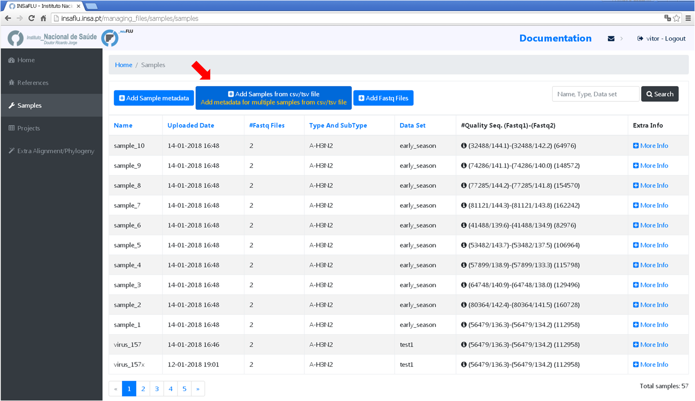

Uploading data
==============

INSaFLU needs: **NGS data** (fastq reads) (mandatory), **Sample metadata** (to link each sample to the respective NGS data) (mandatory) and **Reference data** 
(additional user-restricted reference sequences) (optional)

Uploading Sample metadata and NGS data
++++++++++++++++++++++++++++++++++++++

Samples's information and respective NGS data (single-end or paired-end reads in fastq.gz format obtained through widely used technologies, such as Illumina or Ion Torrent) can be uploaded to INSaFLU as a batch (option 1) or individually (option 2):

# Option 1 (Batch)
------------------

A. Go to **Samples** menu and choose *Add Samples from csv / tsv file*.
.................................................................

The Sample metadata should be a comma-separated value (.csv) or tab-separated value (.tsv) table containing the columns “sample name”, 
“fastq1” and “fastq2” (mandatory columns to fulfill; NOTE: fastq2 is exceptionally not fulfilled only for single-end data) as well these 
additional variables (that may not be fulfilled): “data set”, ”vaccine status”, ”week”, ”onset date”, ”collection date”, ”lab reception date”, ”latitude”,
”longitude”. Users are encouraged to include any other columns with metadata variables to be associated with samples (see advantages below).

Examples of template table files are provided in this menu. 

.. warning::
   Samples names in your account must be unique and only numbers, letters and underscores are allowed.
   Fastq.gz file names must be complete (including extension) and match the ones from the files that you are going to upload later. 

Advantages of uploading enriched 'Sample metadata' tables

The template file contains the following additional variables, which commonly constitute the minimal metadata collected during seasonal influenza surveillance: “data set”, ”vaccine status”, ”week”, ”onset date”, ”collection date”, ”lab reception date”, ”latitude” and ”longitude”. 

The option to upload tables enriched with multiple metadata variables has the clear advantage of allowing the subsequent upload of the samples list of each project (output: "Sample_list.csv" or "Sample_list.tsv") along to the standardized and multi-format outputs of INSaFLU projects (alignments/trees) to downstream platforms for phylogenetic data visualization and/or phylogeographical analysis, such as:

-	PHYLOViZ (http://www.phyloviz.net/), which accepts sample metadata (tab-separated format) plus alignments (FASTA format), among other formats;
-	Phandango (https://jameshadfield.github.io/phandango/#/), which runs sample metadata (csv-separated format) plus a phylogenetic tree (".tree" format);
-	Microreact (https://microreact.org/), which takes sample metadata (in csv-separated format) plus a phylogenetic tree (".nwk" format). 

To take full advantage of particular platforms, such Microreact, which provides a framework where associated data (geographical, temporal, phenotypic or epidemiological) can be easily explored together with phylogenetic data, users may need to specify additional columns in the table (e.g. specifying "year", "month" and "day" columns, along with "latitude" and "longitude" allows Microreact to automatically integrate temporal and geolocation data; ). Also, for colour/shape definitions, you will need to create extra columns (see Microreact instructions here: https://microreact.org/instructions).

.. note::
   It is worthnoting that, for Microreact, depending on the tree (whole-genome or locus-specific trees) that you use (which can include a distinct set of viruses), you will additionally need to match the number of identifiers within the id column to the number of viruses in each tree.
      

B. Go to **Samples** menu and choose *Add Fastq Files*
................................................

Here you can simultaneously upload multiple paired-end fastq.gz files (50MB maximum per file), which are automatically linked to the corresponding samples.

.. image:: _static/upload_sample_ngs_data.png

# Option 2 (Individual)
-----------------------

A. Go to **Samples** menu and choose *Add Sample metadata*
....................................................

Here you can upload each sample at the time (including associated metadata and NGS data).

Uploading Reference data
++++++++++++++++++++++++

INSaFLU needs reference sequence files to be used for reference-based mapping (mandatory) or for extra alignment/phylogeny analyses (optional). 

In References menu, INSaFLU provides a set of ready-to-use reference sequences, all publicly available at NCBI, currently including:

i. post-pandemic (2009) vaccine/reference influenza A(H1N1)pdm2009, A(H3N2) and B viruses (from both Northern and Southern hemispheres);
ii. representative virus of multiple combinations of HA/NA subtypes (i.e., H1N1, H2N2, H5N1, H7N9, etc)

The current list of reference sequences, including locci size and NCIB accession numbers is provided here:

 - :download: `INSaFLU_current_REFERENCE_DATABASE.xlsx <INSaFLU_current_REFERENCE_DATABASE.xlsx>`

The default reference files (FASTA and GenBank formats) have been prepared to fit amplicon-based schemas capturing the whole CDS of the main eight 
genes of influenza virus (PB2, PB1, PA, HA, NP, NA, M and NS), such as the wet-lab pre-NGS protocol (``here``) for influenza whole genome amplification 
adapted from a RT-PCR assay described by Zhou and colleagues (Zhou et al, 2009, for Influenza A; and Zhou et al, 2014, for Influenza B; 
Zhou and Wentworth, 2012)

.. warning::
   If you are using the suggested wet-lab pre-NGS protocol and you want to compare your sequences against a reference available at INSaFLU database, no further actions are needed. 
   Still, you may UPLOAD additional reference files (“.fasta” extension; maximum 20000 bp per file) to the user-restricted reference database.
 
If you use this option, go to **References** menu and choose *Add Reference*

.. note::
   You can upload:
   i. multi-FASTA files containing the set of reference sequences that constitute the influenza “whole-genome” sequence of a particular virus (e.g, the combination of the traditional 8 amplicons targeting the 8 eight influenza RNA segments).
   Each individual sequence must have the precise size of each “intra-amplicon” target sequence that you capture by each one of the RT-PCR amplicons. INSaFLU automatically annotates uploaded multi-FASTA sequences upon submission, but, if you prefer, you can also upload (optionally) the respective multi-GenBank file.
   
   ii. single FASTA files containing a particular complete or partial locus sequence (e.g., the traditionally used HA1 sequence of a virus representative of a particular clades/group). This can be used in “Extra Alignment/Phylogeny” projects.

.. warning::
   See below a guide to generate additional reference sequences

GUIDE TO GENERATE ADDITIONAL REFERENCE SEQUENCES
----------------------------------------------------------

Take this guide into account when generating additional reference sequences.

1. multi-FASTA files to be upload typically contain the set of reference sequences that constitute the influenza “whole-genome” sequence of a particular virus (e.g, the combination of the traditional 8 amplicons targeting the 8 eight influenza RNA segments). Each individual sequence must have the precise size of each “intra-amplicon” target sequence that you capture by each one of the RT-PCR amplicons. 

2. (multi) FASTA format is widely applied to save either nucleotide sequences or peptide sequences. An easy way to handle/generate multi-FASTA files is by opening a text file (e.g., NOTEPAD) and paste individual sequences after each header line. The FASTA IDs (after the '>' character) represent the individual sequence names. For the sake of simplicity, you may designate each sequence as 1, 2, 3, 4, 5, 6 , 7 and 8 (see example), following the traditional influenza segments order (keeping this numerical order is advisable). At the end, you just have to save the multi-FASTA file as “.fasta” (please avoid symbols or blank spaces in the file names). 

3. you may generate your multi-FASTA files in order to fit your amplicon schema by simply adjusting the whole-genome sequences available for download at INSaFLU or at influenza-specific sequence repositories, such as the Influenza Research Database (https://www.fludb.org), NCBI Influenza Virus Resource (https://www.ncbi.nlm.nih.gov/genomes/FLU/Database/nph-select.cgi?go=database) and EpiFLU/GISAID (https://www.gisaid.org/).

4. INSaFLU requires reference sequences exclusively composed by non-degenerate bases (i.e. A, T, C, or G). As such, please ensure that all degenerated bases (e.g., R, Y, M, K, S and W) are replaced by non-degenerate sequences before uploading. The choice of the base used in the replacement (e.g., “A” or “G” when replacing an “R”) has no impact on the analysis. It simply means that mutations falling in the replaced nucleotide position will be reported taking into account the reference base selected.

Explore your Sample and Reference databases
+++++++++++++++++++++++++++++++++++++++++++

**Samples** menu displays all information for all loaded samples (Samples’ names in your account must be unique). Upon submission, INSaFLU automatically 
updates samples’ information with reads quality and typing data (automate bioinformatics pipeline modules “Read quality analysis and improvement” and 
Type and sub-type detection”; see Data analysis in the Documentation). Just explore the “More info” icon next to each sample.

.. image:: _static/Samples_menu.png

**References** menu displays all information for all reference sequences available at your confidential session. Both FASTA and GenBank files can be downloaded
by clicking on the displayed links.

.. image:: _static/Reference_menu.png

References:

- Zhou B, Donnelly ME, Scholes DT, St George K, Hatta M, Kawaoka Y, Wentworth DE. 2009. Single-reaction genomic amplification accelerates sequencing and vaccine production for classical and Swine origin human influenza a viruses. J Virol, 83:10309-13.

- Zhou B, Lin X, Wang W, Halpin RA, Bera J, Stockwell TB, Barr IG, Wentworth DE.  2014. Universal influenza B virus genomic amplification facilitates sequencing, diagnostics, and reverse genetics. J Clin Microbiol, 52:1330-1337. 

- Zhou B, Wentworth DE. 2012. Influenza A virus molecular virology techniques. Methods Mol Biol, 865:175-92.
