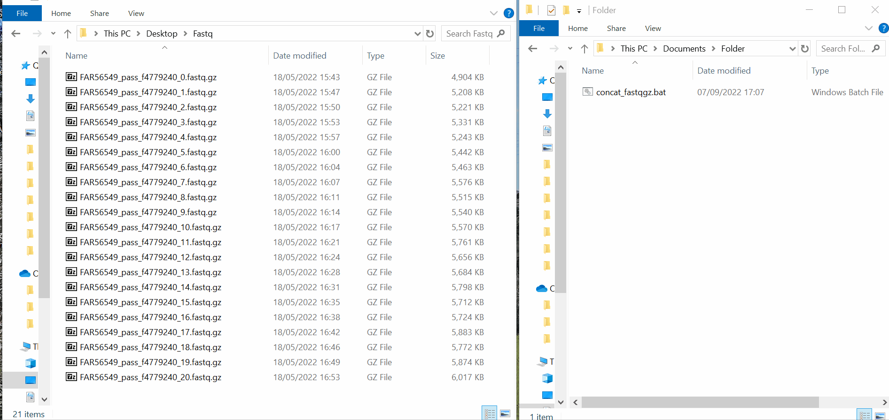
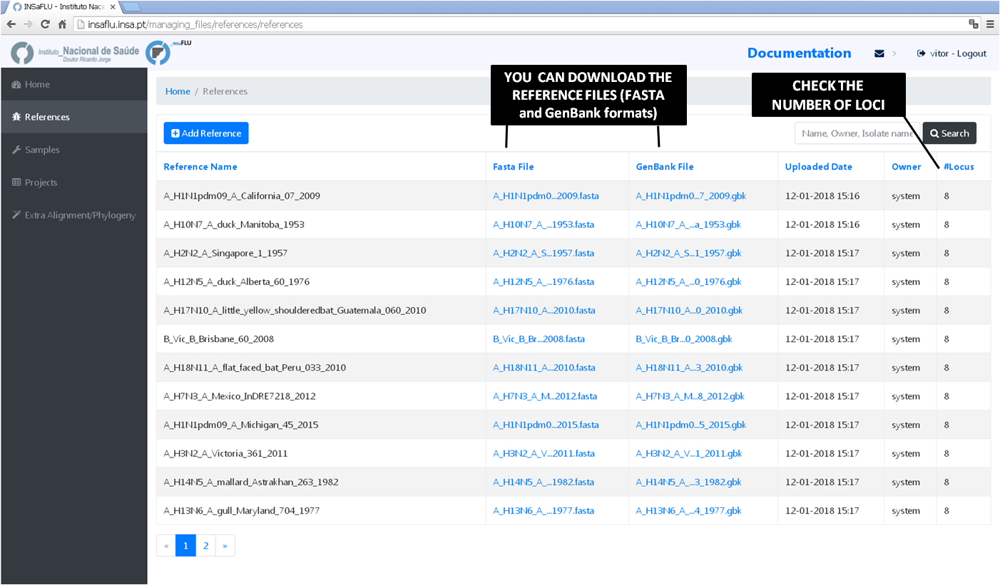

**Uploading or Updating data**
===============================

INSaFLU needs: 

- **NGS data** (fastq reads) (**mandatory**)

- **Sample metadata** (to link each sample to the respective NGS data) (**mandatory**) 

- **Reference data** (additional user-restricted reference sequences) (*optional*)

Uploading Sample metadata and NGS data
++++++++++++++++++++++++++++++++++++++

**Samples's metadata** and respective **NGS data** (single-end or paired-end reads in fastq.gz format obtained through widely used technologies, such as Illumina or Ion Torrent) can be uploaded to INSaFLU as a **batch (option 1)** or **individually (option 2)**:

# Option 1 (Batch)
------------------

A. Go to *Samples* menu and choose *Add Multiple Samples / Load new file*.
...........................................................................

*Examples of template table files are provided in this menu.*

*Here is how to upload the metadata table:*

.. important::
   Sample metadata should be a comma-separated value (.csv) or tab-separated value (.tsv or .txt) table containing the columns **“sample name”**, **“fastq1”** and **“fastq2”** (**mandatory columns to fulfill**; NOTE: fastq2 is exceptionally not fulfilled only for single-end data) as well these additional variables (that may not be fulfilled): **“data set”**, **”vaccine status”**, **”week”**, **”onset date”**, **”collection date”**, **”lab reception date”**, **”latitude”**, **”longitude”**. If you include data for **latitude/longitude** and/or **country, region, division and/or location**, these will be used to geographically locate your samples in the **Nextstrain Datasets**
   
   Users are encouraged to include any other columns with metadata variables to be associated with samples (see advantages below).
   
   The table will be locked until you submit the NGS reads corresponding to the new samples. In case you decide not to proceed with the upload, the table can be unlocked by clicking in "Unlock last file". 

.. important::
   Samples names in your account must be unique and only numbers, letters and underscores are allowed.
   
   Fastq.gz file names must be complete (including extension) and match the ones from the files that you are going to upload later. 

**Advantages of uploading enriched Sample metadata tables**

The template file contains the following additional variables, which commonly constitute the minimal metadata collected during seasonal influenza surveillance: “data set”, ”vaccine status”, ”week”, ”onset date”, ”collection date”, ”lab reception date”, ”latitude” and ”longitude”. (The "data set" column will help you to organize samples by specific groups, e.g., "early_season", "peak", etc). Users are also recommended to include data for for **latitude/longitude** and/or **country, region, division and/or location**, as these fields will allow geographically locate your samples in the **Nextstrain Datasets**. Still, users are encouraged to include any other columns with metadata variables to be associated with samples. 

Uploading tables enriched with multiple metadata variables will allow you to easily color the phylogenetic tree nodes (and/or add colored metadata blocks to the tree) according to any combination of metadata variables, which largely facilitates the visualization and exploration of your data.

Also, it has the clear advantage of allowing the subsequent upload of the samples list of each project (output: "Sample_list.csv" or "Sample_list.tsv") along to the standardized and multi-format outputs of INSaFLU projects (alignments/trees) to other platforms for phylogenetic data visualization and/or phylogeographical analysis, such as:

-	auspice (https://auspice.us/), which takes JSON files or sample metadata (in tsv-separated format) plus a phylogenetic tree (".nwk" format).
-	Phandango (https://jameshadfield.github.io/phandango/#/), which runs sample metadata (csv-separated format) plus a phylogenetic tree (".tree" format);
-	Microreact (https://microreact.org/), which takes sample metadata (in csv-separated format) plus a phylogenetic tree (".nwk" format). 

.. note::
   To take full advantage of particular platforms, such Microreact, which provides a framework where associated data (geographical, temporal, phenotypic or epidemiological) can be easily explored together with phylogenetic data, users may need to specify additional columns in the table (e.g. specifying "year", "month" and "day" columns, along with "latitude" and "longitude" allows Microreact to automatically integrate temporal and geolocation data; ). Also, for colour/shape definitions, you will need to create extra columns (see Microreact instructions here: https://microreact.org/instructions).

   It is worthnoting that, for Microreact, depending on the tree (whole-genome or locus-specific trees) that you use (which can include a distinct set of viruses), you will additionally need to match the number of identifiers within the id column to the number of viruses in each tree.
      

B. Go to *Samples* menu and choose *Add Fastq Files*
....................................................

Go to your fastq.gz directory and **simultaneously upload multiple fastq.gz files**, which are automatically linked to the corresponding samples.

Reads (fastq.gz)  can be selected from the multi-select dialog box or just DRAG & DROPPED.
 

Fastq.gz files that are not attached to any sample can be deleted by clicking in "Remove all files not processed".

.. note::
	**How to merge several ONT fastq/fastq.gz files into a single ONT fastq/fastq.gz on "Windows" or "MAC" (see video below):**
	
	1. Download one of these files from https://github.com/INSaFLU/INSaFLU/raw/master/files_helpful/ (check the README)
	
	- **concat_fastq**  (for fastq files)
	
	- **concat_fastqgz** (for fastq.gz)
	
	
	2. Create a folder where you only put the fastq/fastq.gz you wish to concatenate
	3. Copy&paste the adequate “.bat” (Windows) or ".command" (MAC) file (whether you have fastq or fastq.gz) to the same folder and double-click on the file
	
	This will automatically **create a single file named “concat.fastq.gz” (or “concat.fastq”)** inside the same folder. You can then rename this file as needed. (Note that this will not eliminate or change the original fastq inside the folder.)

.. important::
   Original reads (i.e., the fastq.gz files uploaded) will be deleted (normally after 10 days) of their upload. In fact, after quality analysis and improvement, the INSaFLU pipeline does not use those original reads for any other downstream analysis (all quality reports and derived quality processed reads are kept available for download).

# Option 2 (Individual)
-----------------------

A. Go to *Samples* menu and choose *Add One Sample*
........................................................

Here you can upload each sample at the time (including associated metadata and NGS data).

Example for a ONT sample:

Example for a Illumina (paired-end) sample:

.. important::
   Original reads (i.e., the fastq.gz files uploaded) will be deleted (normally after 10 days) of their upload. In fact, after quality analysis and improvement, the INSaFLU pipeline does not use those original reads for any other downstream analysis (all quality reports and derived quality processed reads are kept available for download).

.. note::
	**How to merge several ONT fastq/fastq.gz files into a single ONT fastq/fastq.gz on "Windows" or "MAC" (see video below):**
	
	1. Download one of these files from https://github.com/INSaFLU/INSaFLU/raw/master/files_helpful/ (check the README)
	
	- **concat_fastq**  (for fastq files)
	
	- **concat_fastqgz** (for fastq.gz)
	
	
	2. Create a folder where you only put the fastq/fastq.gz you wish to concatenate
	3. Copy&paste the adequate “.bat” (Windows) or ".command" (MAC) file (whether you have fastq or fastq.gz) to the same folder and double-click on the file
	
	This will automatically **create a single file named “concat.fastq.gz” (or “concat.fastq”)** inside the same folder. You can then rename this file as needed. (Note that this will not eliminate or change the original fastq inside the folder.)

.. important::
   This "individual" upload option does not allow the user to add additional metadata fields (contrarily to batch upload; see next section to lear how to update the sample metadata).

   Original reads (i.e., the fastq.gz files uploaded) will be deleted (normally after 10 days) of their upload. In fact, after quality analysis and improvement, the INSaFLU pipeline does not use those original reads for any other downstream analysis (all quality reports and derived quality processed reads are kept available for download).

Updating Sample metadata
++++++++++++++++++++++++

A. In *Samples* menu (only for Samples with read data)
......................................................

You can add/update the **Samples's metadata** at any time by simply uploading a table comma-separated (.csv) or tab-separated (.tsv or .txt) table with the updated data (a template file is provided), as follows:

-	Go to *Samples* menu and choose *Update metadata*, then Load a new file, using one of the provided template files. 

.. important::
	The table for Sample metadata update should contain the columns “sample name” (exactly corresponding to the samples to be updated), as well these additional variables (that may not be fulfilled): “data set”, ”vaccine status”, ”week”, ”onset date”, ”collection date”, ”lab reception date”, ”latitude”, ”longitude”, "country, region", "division" and/or "location". If you include data for **"latitude" and "longitude"** AND/OR **country, region, division and/or location**, these will be used to geographically locate your samples in the **Nextstrain Datasets**. Still, users are encouraged to include any other columns with metadata variables to be associated with samples (see advantages above).

.. note::
	You cannot update the fastq files. To replace the fastq files associated with a given sample, you need to delete the respective sample and upload all data (metadata plus fastq) again, i.e., create a new sample.  You must ensure that the sample to be deleted is not inserted in any Project before deleting it.
	
	Samples names in your account must be unique and only numbers, letters and underscores are allowed.

B. In *Dataset* menu (to update Nextstrain metadata)
.....................................................

You can add/update the Nextstrain metadata of a given *Dataset* by clicking in **"Metadata for Nextstrain"**, download the previous table, update it with new data and upload it again. Then, you need to click in the "hourglass" icon to Rebuild the Nextstrain outputs. When the new JSON file is generated, the updated metadata can then be  **drag-and drop**  to auspice.us after the JSON file to update the displayed metadata.

Notes:
- This update option is exclusive of each Dataset.
- To add/update the metadata associated with consensus sequences derived from read data in INSaFLU *Projects* module, you can also add/update the metadata following these instructions of the previous point "A" (this option is not available for "external" consensus sequences).

Uploading Reference data
++++++++++++++++++++++++

INSaFLU needs reference sequence files to be used for reference-based mapping. 

In *References* menu, **INSaFLU provides a set of ready-to-use reference sequences**, all publicly available at NCBI (or made available under permission of authors), currently including:

	i. post-pandemic (2009) vaccine/reference influenza A(H1N1)pdm2009, A(H3N2) and B viruses (from both Northern and Southern hemispheres);
	ii. representative virus of multiple combinations of HA/NA subtypes (i.e., H1N1, H2N2, H5N1, H7N9, etc)
	iii. SARS-CoV-2 reference genome sequence (Wuhan-Hu-1; NCBI accession MN908947)
	iv. Mpox reference sequences
	v. RSV references sequences 

The current list of reference sequences, including loci size and NCBI accession numbers is provided here:

:download:`INSaFLU_current_REFERENCE_DATABASE_07_03_2023.xlsx <_static/INSaFLU_current_REFERENCE_DATABASE_07_03_2023.xlsx>`

NOTE: The default seasonal influenza reference files (FASTA and GenBank formats) have been prepared to fit amplicon-based schemas capturing the whole CDS of the main eight genes of influenza virus (PB2, PB1, PA, HA, NP, NA, M and NS), such as the wet-lab pre-NGS protocol for influenza whole genome amplification adapted from a RT-PCR assay described by Zhou and colleagues (Zhou et al, 2009, for Influenza A; and Zhou et al, 2014, for Influenza B; Zhou and Wentworth, 2012).

You can download the suggested protocol here: :download:`Suggested_RT_PCR_assay_for_influenza_WGS.pdf <_static/Suggested_RT_PCR_assay_for_influenza_WGS.pdf>`

.. important::
    **NO FURTHER ACTIONS ARE NEEDED** if you are using the suggested wet-lab pre-NGS protocol and you want to compare your sequences against a reference available at INSaFLU database.
    
    However, you may need to UPLOAD additional reference files to the user-restricted reference database. For instance, you may need to upload the A/H3N2 vaccine reference sequence for the season 2017/2018 (A/Hong Kong/4801/2014 virus), which is not freely available.    
   
       
       
**To upload additional reference sequences**, GO TO *References* MENU and CHOOSE **Add Reference**

You can eitheir:

 - **Upload a FASTA + GENBANK file**

.. note::
   
   Your genbank file must be compatible with INSaFLU.
   ## See below a GUIDE to generate additional reference sequences

- **Upload a FASTA file**

*In this case, INSaFLU will automatically generate an annotation in GenBabk format** 

.. note::
   
   Important notes - upload new References:
   
   1. Multi-FASTA files to be uploaded will typically contain the set of reference sequences that constitute the influenza “whole-genome” sequence of a particular virus (e.g, the combination of the traditional 8 amplicons targeting the 8 eight influenza RNA segments). Still, you are free to upload references files including a specific panel of segments/genes (e.g, segments 4 and 6, which encode the surface proteins HA and NA, respectively)  
   
   2. Each individual sequence of the multi-FASTA file should ideally have the size of each “intra-amplicon” target sequence that you capture by each one of the RT-PCR amplicons. Otherwise, you will get regions with no or low coverage (these will be masked with undefined bases NNN according to the user-defined coverage thresholds).
   
   3. INSaFLU automatically annotates the uploaded multi-FASTA sequences upon submission, but, if you prefer, you can also upload (optionally) the respective multi-GenBank file.   
   
   ## See below a GUIDE to generate additional reference sequences

GUIDE TO GENERATE ADDITIONAL REFERENCE SEQUENCES
----------------------------------------------------------

Please take this guide into account when generating additional reference sequences.

1. (Multi-)FASTA files to be upload typically contain the reference sequence(s) that constitute the “whole-genome” sequence of a particular virus (e.g, the combination of the traditional 8 amplicons targeting the 8 eight influenza RNA segments in a MULTI-FASTA file or the reference genome sequence for SARS-CoV2 in a Single FASTA file). **Each individual sequence should ideally have the precise size of each “intra-amplicon” target sequence that you capture by each one of the RT-PCR amplicons**. Otherwise, you will obtain regions with no or low coverage (these will be masked with undefined bases NNN according to the user-defined coverage thresholds)
   
2. You may generate your (multi-)FASTA files in order to fit your amplicon schema by simply adjusting the whole-genome sequences available for download at INSaFLU or at influenza-specific sequence repositories, such as the Influenza Research Database (https://www.fludb.org), NCBI Influenza Virus Resource (https://www.ncbi.nlm.nih.gov/genomes/FLU/Database/nph-select.cgi?go=database) and EpiFLU/GISAID (https://www.gisaid.org/).

3. An easy way to handle/generate (multi-)FASTA files is by opening a text file (e.g., NOTEPAD) and paste individual sequences after each header line. The FASTA IDs (after the '>' character) represent the individual sequence names. For the sake of simplicity, you may designate each sequence as 1, 2, 3, 4, 5, 6 , 7 and 8 (see example), following the traditional influenza segments order (keeping this numerical order is advisable). At the end, you just have to save the (multi-)FASTA file as “.fasta”. **Please avoid symbols or blank spaces in the file names**. 
			
			example:  :download:`A_H3N2_A_Perth_16_2009.fasta <_static/A_H3N2_A_Perth_16_2009.fasta>`

4. INSaFLU automatically annotates uploaded (multi-)FASTA sequences upon submission, but, if you prefer, you can also upload (optionally) the respective multi-GenBank file. **If you upload FASTA and respective GenBank files that have been downloaded from NCBI, please make sure that FASTA ID(s) (after the '>' character) match the name/number that appears in the LOCUS and ACCESSION lines of the GenBank file.**

5. **INSaFLU requires reference sequences exclusively composed by non-degenerate bases (i.e. A, T, C, or G)**. As such, please ensure that all degenerated bases (e.g., R, Y, M, K, S and W) are replaced by non-degenerate sequences before uploading. The choice of the base used in the replacement (e.g., “A” or “G” when replacing an “R”) has no impact on the analysis. It simply means that mutations falling in the replaced nucleotide position will be reported taking into account the reference base selected.

Explore your Sample and Reference databases
+++++++++++++++++++++++++++++++++++++++++++

*Samples* menu displays all information for all loaded samples (Samples’ names in your account must be unique). 

Upon submission, INSaFLU automatically updates samples’ information with reads quality and typing data (automate bioinformatics pipeline modules “Read quality analysis and improvement” and Type and sub-type detection”; see Data analysis in the Documentation). 

Just explore the “More info” icon next to each sample.

*References* menu displays all information for all reference sequences available at your confidential session. 

Both FASTA and GenBank files can be downloaded by clicking on the displayed links.

References:

- Zhou B, Donnelly ME, Scholes DT, St George K, Hatta M, Kawaoka Y, Wentworth DE. 2009. Single-reaction genomic amplification accelerates sequencing and vaccine production for classical and Swine origin human influenza a viruses. J Virol, 83:10309-13.

- Zhou B, Lin X, Wang W, Halpin RA, Bera J, Stockwell TB, Barr IG, Wentworth DE.  2014. Universal influenza B virus genomic amplification facilitates sequencing, diagnostics, and reverse genetics. J Clin Microbiol, 52:1330-1337. 

- Zhou B, Wentworth DE. 2012. Influenza A virus molecular virology techniques. Methods Mol Biol, 865:175-92.
